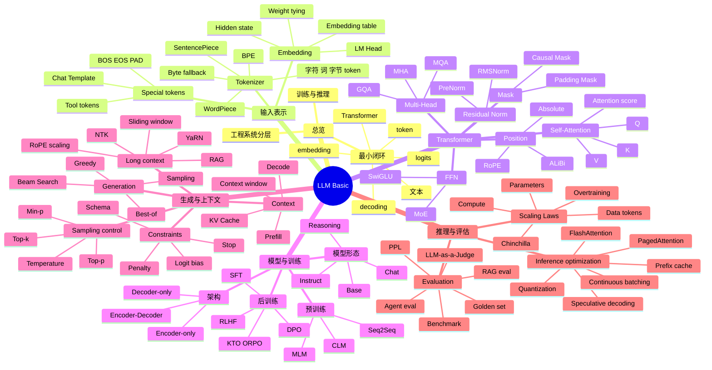

---
tags:
  - LLM
  - AI-Agent
  - 学习路线
created: 2026-05-21
description: LLM 基础知识目录，覆盖模型结构、训练目标、生成策略、上下文、推理优化与评估
---

# LLM 基础

> 这个目录用于梳理 AI Agent 开发者必须理解的大语言模型基础。它既是索引页，也是复习页：先按知识点定位文档，再用思维导图把概念串回一条主线。

---

# 1. 总体主线

LLM 基础可以压缩成一条链路：

```text
文本
  -> Tokenizer
  -> token id
  -> Embedding
  -> Transformer
  -> hidden state
  -> LM Head
  -> logits
  -> 生成策略
  -> 输出 token
```

围绕这条链路，需要理解 6 组问题：

| 问题组 | 核心问题 | 对应文档 |
|---|---|---|
| 输入表示 | 文本如何变成模型能处理的数字？ | [[02-Tokenizer-Embedding]] |
| 上下文建模 | token 之间如何传递信息？ | [[01-Transformer]]、[[03-LLM-Variants]] |
| 能力训练 | 模型如何从续写器变成助手？ | [[04-Training-Objectives]] |
| 输出控制 | logits 如何变成稳定、可用的输出？ | [[05-Generation-Strategies]] |
| 推理成本 | 为什么长上下文和在线服务很贵？ | [[06-Context-Window-KV-Cache]]、[[07-Length-Extrapolation]]、[[08-Inference-Optimization]] |
| 选择评估 | 如何选择、扩展和评估模型？ | [[09-Scaling-Laws]]、[[10-Model-Evaluation]] |

---

# 2. 学习顺序

完全零基础建议按下面顺序读：

```text
00 -> 02 -> 01 -> 03 -> 04 -> 05 -> 06 -> 07 -> 08 -> 09 -> 10
```

| 顺序 | 文档 | 应该带走的核心问题 |
|---:|---|---|
| 0 | [[00-LLM-Overview]] | LLM 如何从文本得到 logits，再逐 token 生成回答？ |
| 1 | [[02-Tokenizer-Embedding]] | 字符串如何变成 token id 和向量，为什么 token 数影响成本？ |
| 2 | [[01-Transformer]] | Transformer 如何让每个 token 汇聚上下文信息？ |
| 3 | [[03-LLM-Variants]] | Encoder、Decoder、Encoder-Decoder 的“看见方式”有什么本质区别？ |
| 4 | [[04-Training-Objectives]] | 预训练、SFT、偏好对齐分别在修什么问题？ |
| 5 | [[05-Generation-Strategies]] | 模型给出概率分布后，解码策略如何把概率变成可用输出？ |
| 6 | [[06-Context-Window-KV-Cache]] | 上下文窗口为什么是工作记忆，KV Cache 为什么能加速推理？ |
| 7 | [[07-Length-Extrapolation]] | 长上下文为什么不只是“把窗口调大”？ |
| 8 | [[08-Inference-Optimization]] | 推理优化应该先找 prefill、decode、KV 还是调度瓶颈？ |
| 9 | [[09-Scaling-Laws]] | 参数量、数据量、算力应该如何在预算下分配？ |
| 10 | [[10-Model-Evaluation]] | 评估如何定位模型在目标任务上的失败模式？ |

如果只做应用开发，最低限度先读：

```text
00 -> 02 -> 05 -> 06 -> 10
```

这条路径能先解决：输入怎么计费、输出怎么控制、上下文为什么贵、上线怎么评估。

---

# 3. 知识点索引

## 3.1 从输入到输出

| 想查的知识点 | 主要文档 | 关联文档 | 复习提示 |
|---|---|---|---|
| LLM 最小闭环 | [[00-LLM-Overview#2. 基础机制：从文本到输出的最小闭环]] | [[05-Generation-Strategies#2. 基础机制：从 logits 到 token 的完整链路]] | 记住 `文本 -> token -> embedding -> Transformer -> logits -> token` |
| token、字符、词、字节 | [[02-Tokenizer-Embedding#2. Token、字符、词、字节的区别]] | [[06-Context-Window-KV-Cache#1. 核心问题：上下文窗口为什么是模型的工作记忆]] | token 不是字数，token 数决定上下文、成本和延迟 |
| Tokenizer 流程 | [[02-Tokenizer-Embedding#3. 基础机制：Tokenizer 的基本流程]] | [[00-LLM-Overview#2. 基础机制：从文本到输出的最小闭环]] | normalization、pre-tokenization、subword、special tokens |
| 子词算法 | [[02-Tokenizer-Embedding#4. 同族概念分组：子词切分算法家族]] | [[02-Tokenizer-Embedding#12. 工程含义：Tokenizer 对中文的影响]] | BPE、WordPiece、SentencePiece 都是在平衡词表大小和泛化 |
| 特殊 token 与 Chat Template | [[02-Tokenizer-Embedding#5. 同族概念分组：特殊 Token 与 Chat Template]] | [[04-Training-Objectives#9. 工具调用和结构化输出训练]] | Chat 模型不是裸文本续写，消息角色会被模板化 |
| Embedding、LM Head、Weight Tying | [[02-Tokenizer-Embedding#8. 基础机制：Embedding 是什么]] | [[02-Tokenizer-Embedding#11. 基础机制：LM Head 与 Weight Tying]] | Embedding 是入口表示，LM Head 是输出到词表 |

## 3.2 Transformer 与架构

| 想查的知识点 | 主要文档 | 关联文档 | 复习提示 |
|---|---|---|---|
| Transformer Block | [[01-Transformer#1. 核心问题：Transformer 如何让 token 理解上下文]] | [[01-Transformer#13. 工程含义：一个 token 怎么走完模型]] | Attention 传信息，FFN 做加工，Residual/Norm 保稳定 |
| Q/K/V 与 Attention | [[01-Transformer#3. 基础机制：Self-Attention 如何汇聚上下文]] | [[01-Transformer#5. 同族概念分组：Attention 的头、共享和缓存]] | Q 是查询，K 是匹配索引，V 是被聚合内容 |
| Mask | [[01-Transformer#4. Mask：让模型看该看的内容]] | [[04-Training-Objectives#4. Causal Mask：训练并行与生成约束如何同时成立]] | Padding Mask 处理补齐，Causal Mask 防止偷看未来 |
| 位置编码 | [[01-Transformer#6. 同族概念分组：位置编码负责补上顺序]] | [[07-Length-Extrapolation#3. 同族概念分组：位置外推方案]] | Attention 本身不懂顺序，位置编码补顺序归纳偏置 |
| FFN、SwiGLU、MoE | [[01-Transformer#7. 基础组件：Feed Forward Network 负责逐位置加工]] | [[03-LLM-Variants#12. Dense 与 MoE：从 FFN 开始理解]] | FFN 往往占大量参数，MoE 是把 FFN 专家化 |
| Norm 与 Residual | [[01-Transformer#8. 基础组件：Residual 与 Normalization 负责稳定训练]] | [[01-Transformer#12. 同族概念分组：现代 LLM 中常见的 Transformer 配方]] | Residual 让信息和梯度能穿过深层网络 |
| Encoder、Decoder、Encoder-Decoder | [[03-LLM-Variants#2. 基础机制：三种“看见方式”]] | [[03-LLM-Variants#7. 三大架构对比：把基础差异放在一张表]] | 架构差异本质是“能看见什么上下文” |
| Decoder-only 为什么主流 | [[03-LLM-Variants#8. 为什么现在通用 LLM 多是 Decoder-only]] | [[04-Training-Objectives#3. 同族概念分组：预训练目标如何塑造基础能力]] | 生成、上下文学习、对齐和推理缓存都顺 |

## 3.3 训练、对齐与模型形态

| 想查的知识点 | 主要文档 | 关联文档 | 复习提示 |
|---|---|---|---|
| Next Token Prediction | [[04-Training-Objectives#3. 同族概念分组：预训练目标如何塑造基础能力]] | [[00-LLM-Overview#4. 训练与推理：同一个模型的两种状态]] | 朴素目标逼模型学习语言、知识、格式和推理模式 |
| MLM 与 Seq2Seq | [[04-Training-Objectives#5. MLM：为什么 BERT 更像阅读理解模型]] | [[04-Training-Objectives#6. Seq2Seq：为什么 T5 适合输入到输出转换]] | MLM 适合理解，Seq2Seq 适合输入到输出转换 |
| 继续预训练 vs SFT | [[04-Training-Objectives#7. 继续预训练：补知识还是改行为]] | [[04-Training-Objectives#12. 工程含义：如何选择训练方法]] | 缺知识和分布用继续预训练，缺行为和格式用 SFT |
| SFT、RLHF、DPO | [[04-Training-Objectives#8. 同族概念分组：后训练如何改变模型行为]] | [[03-LLM-Variants#13. Base、Instruct、Chat、Reasoning：这不是架构差异]] | SFT 学模仿，RLHF/DPO 学偏好 |
| 工具调用和结构化输出训练 | [[04-Training-Objectives#9. 工具调用和结构化输出训练]] | [[05-Generation-Strategies#7. 工程含义：结构化输出不要只靠“请输出 JSON”]] | 工具能力既靠训练，也靠推理时 schema 约束 |
| Base、Instruct、Chat、Reasoning | [[03-LLM-Variants#13. Base、Instruct、Chat、Reasoning：这不是架构差异]] | [[04-Training-Objectives#8. 同族概念分组：后训练如何改变模型行为]] | 这些主要是训练和对齐阶段差异，不是架构差异 |

## 3.4 生成、上下文与推理

| 想查的知识点 | 主要文档 | 关联文档 | 复习提示 |
|---|---|---|---|
| logits 到 token | [[05-Generation-Strategies#2. 基础机制：从 logits 到 token 的完整链路]] | [[00-LLM-Overview#1. 核心问题：LLM 到底在做什么]] | 生成策略是 logits processor / warper / selector 的组合 |
| Greedy、Sampling、Beam、Best-of | [[05-Generation-Strategies#4. 同族概念分组：选择策略决定怎么选 token]] | [[10-Model-Evaluation#9. 工程含义：业务黄金集是真正有用的评估资产]] | 先决定稳定、开放还是多候选评选 |
| Temperature、Top-k、Top-p | [[05-Generation-Strategies#5. 同族概念分组：分布塑形和候选过滤控制随机性]] | [[05-Generation-Strategies#11. 常见误区与调参]] | Temperature 改分布形状，Top-p/Top-k 改候选集合 |
| 重复惩罚、stop、logit bias | [[05-Generation-Strategies#6. 同族概念分组：logits 约束和停止控制让输出可用]] | [[02-Tokenizer-Embedding#15. 工程含义：Tokenizer 与安全]] | 硬约束要注意 token 边界和业务校验 |
| 上下文窗口 | [[06-Context-Window-KV-Cache#1. 核心问题：上下文窗口为什么是模型的工作记忆]] | [[07-Length-Extrapolation#1. 核心问题：长上下文不是把窗口调大]] | 上下文是工作记忆，不是无限记忆 |
| prefill 与 decode | [[06-Context-Window-KV-Cache#4. 基础机制：Prefill 与 Decode 的两段时间线]] | [[08-Inference-Optimization#3. 基础机制：prefill 和 decode 为什么瓶颈不同]] | 首 token 慢看 prefill，后续 token 慢看 decode |
| KV Cache | [[06-Context-Window-KV-Cache#5. KV Cache 缓存的到底是什么]] | [[08-Inference-Optimization#4. 同族概念分组：按瓶颈理解优化技术]] | 缓存的是每层历史 token 的 K/V，不是最终答案 |
| 长上下文三关 | [[07-Length-Extrapolation#1. 核心问题：长上下文不是把窗口调大]] | [[06-Context-Window-KV-Cache#3. 为什么长上下文贵]] | 放得进、算得动、用得好 |
| FlashAttention、PagedAttention、Batching | [[08-Inference-Optimization#4. 同族概念分组：按瓶颈理解优化技术]] | [[06-Context-Window-KV-Cache#9. 同族概念分组：降低 KV Cache 成本的方法]] | Flash 优化 IO，Paged 管 KV，Batching 管调度 |

## 3.5 规模、选择与评估

| 想查的知识点 | 主要文档 | 关联文档 | 复习提示 |
|---|---|---|---|
| Scaling Laws | [[09-Scaling-Laws#1. 核心问题：Scaling Laws 为什么是预算分配问题]] | [[09-Scaling-Laws#2. 基础机制：参数量、数据量、计算量]] | 它是预算分配问题，不是参数崇拜 |
| Chinchilla 与 Overtraining | [[09-Scaling-Laws#4. 同族概念分组：Kaplan、Chinchilla 与 Overtraining]] | [[08-Inference-Optimization#10. 并行与路由：不是所有请求都该进同一个模型]] | 小而充分训练的模型可能更适合高频推理 |
| 涌现能力 | [[09-Scaling-Laws#6. 涌现能力：不要神秘化]] | [[10-Model-Evaluation#4. 同族概念分组：离线评估只能回答部分问题]] | 可能来自规模、数据、任务格式和评估阈值共同作用 |
| PPL 与 Benchmark | [[10-Model-Evaluation#3. Perplexity：适合语言建模监控，不等于助手质量]] | [[10-Model-Evaluation#4. 同族概念分组：离线评估只能回答部分问题]] | PPL 适合语言建模监控，不等于助手质量 |
| RAG 评估 | [[10-Model-Evaluation#6. RAG 评估：拆开检索和生成]] | [[07-Length-Extrapolation#6. 同族概念分组：RAG 是外部检索，不是长度外推]] | 拆成检索、上下文、忠实性、引用准确性 |
| Agent 评估 | [[10-Model-Evaluation#7. Agent 评估：看过程，不只看最终答案]] | [[06-Context-Window-KV-Cache#12. Agent 场景怎么管理上下文]] | 看工具选择、参数、恢复、循环和成本 |
| LLM-as-a-Judge 与黄金集 | [[10-Model-Evaluation#8. LLM-as-a-Judge：让模型评模型，但要校准]] | [[10-Model-Evaluation#9. 工程含义：业务黄金集是真正有用的评估资产]] | Judge 要人工校准，黄金集才是业务回归资产 |

---

# 4. 复习思维导图



---

# 5. 回忆路线

## 5.1 一句话回忆

| 模块                             | 一句话                                                 |
| ------------------------------ | --------------------------------------------------- |
| [[00-LLM-Overview]]            | LLM 是根据上下文预测下一个 token 的系统。                          |
| [[02-Tokenizer-Embedding]]     | Tokenizer 决定文本如何离散化，Embedding 决定 token 如何进入模型。      |
| [[01-Transformer]]             | Attention 让 token 通信，FFN 加工表示，Residual/Norm 保持深层稳定。 |
| [[03-LLM-Variants]]            | 架构差异本质是模型能看见哪些上下文。                                  |
| [[04-Training-Objectives]]     | 预训练学能力，SFT 学指令，偏好对齐学选择更好的回答。                        |
| [[05-Generation-Strategies]]   | 解码策略把 logits 变成满足任务目标的 token。                       |
| [[06-Context-Window-KV-Cache]] | 上下文是工作记忆，KV Cache 是自回归推理缓存。                         |
| [[07-Length-Extrapolation]]    | 长上下文要同时放得进、算得动、用得好。                                 |
| [[08-Inference-Optimization]]  | 推理优化先定位 prefill、decode、KV 显存或调度瓶颈。                  |
| [[09-Scaling-Laws]]            | Scaling Laws 是参数、数据和算力的预算分配问题。                      |
| [[10-Model-Evaluation]]        | 评估不是问模型强不强，而是找目标任务上的失败模式。                           |

## 5.2 十分钟速查

1. 先看 [[00-LLM-Overview#2. 基础机制：从文本到输出的最小闭环|LLM 最小闭环]]。
2. 再看 [[02-Tokenizer-Embedding#14. 工程含义：Token 预算|Token 预算]]，记住成本和上下文都按 token 走。
3. 复习 [[01-Transformer#3. 基础机制：Self-Attention 如何汇聚上下文|Self-Attention]]，把 Q/K/V 讲顺。
4. 对比 [[03-LLM-Variants#7. 三大架构对比：把基础差异放在一张表|三大架构]]，记住“看见方式”。
5. 串起 [[04-Training-Objectives#8. 同族概念分组：后训练如何改变模型行为|SFT/RLHF/DPO]] 的差异。
6. 回忆 [[05-Generation-Strategies#5. 同族概念分组：分布塑形和候选过滤控制随机性|Temperature/Top-p/Top-k]] 的因果关系。
7. 讲清 [[06-Context-Window-KV-Cache#4. 基础机制：Prefill 与 Decode 的两段时间线|prefill/decode]] 和 [[06-Context-Window-KV-Cache#5. KV Cache 缓存的到底是什么|KV Cache]]。
8. 用 [[08-Inference-Optimization#4. 同族概念分组：按瓶颈理解优化技术|瓶颈表]] 区分 FlashAttention、PagedAttention、Batching。
9. 用 [[09-Scaling-Laws#4. 同族概念分组：Kaplan、Chinchilla 与 Overtraining|Chinchilla/Overtraining]] 解释小模型价值。
10. 用 [[10-Model-Evaluation#9. 工程含义：业务黄金集是真正有用的评估资产|业务黄金集]] 收尾，说明如何判断模型能不能上线。

## 5.3 面试自测

| 问题 | 去哪里复习 |
|---|---|
| LLM 为什么能用 next token prediction 学到知识？ | [[04-Training-Objectives#3. 同族概念分组：预训练目标如何塑造基础能力]] |
| Q/K/V 分别是什么，为什么要 multi-head？ | [[01-Transformer#3. 基础机制：Self-Attention 如何汇聚上下文]]、[[01-Transformer#5. 同族概念分组：Attention 的头、共享和缓存]] |
| 为什么主流通用 LLM 多是 Decoder-only？ | [[03-LLM-Variants#8. 为什么现在通用 LLM 多是 Decoder-only]] |
| SFT、RLHF、DPO 的区别是什么？ | [[04-Training-Objectives#8. 同族概念分组：后训练如何改变模型行为]] |
| Temperature、Top-p、Top-k 分别影响什么？ | [[05-Generation-Strategies#5. 同族概念分组：分布塑形和候选过滤控制随机性]] |
| 为什么长 prompt 首 token 慢？ | [[06-Context-Window-KV-Cache#4. 基础机制：Prefill 与 Decode 的两段时间线]] |
| KV Cache 缓存的是什么？ | [[06-Context-Window-KV-Cache#5. KV Cache 缓存的到底是什么]] |
| 长上下文和 RAG 怎么选？ | [[07-Length-Extrapolation#7. 工程含义：长上下文 vs RAG 怎么选]] |
| FlashAttention 和 PagedAttention 区别是什么？ | [[08-Inference-Optimization#4. 同族概念分组：按瓶颈理解优化技术]] |
| 为什么 Scaling Laws 不是参数崇拜？ | [[09-Scaling-Laws#1. 核心问题：Scaling Laws 为什么是预算分配问题]] |
| 为什么 PPL 不等于助手质量？ | [[10-Model-Evaluation#3. Perplexity：适合语言建模监控，不等于助手质量]] |

---

# 6. 与其他目录的边界

- 本目录讲 LLM 本体基础。
- Prompt 技巧放到 `Prompt Engineering`。
- RAG 检索、切分、重排放到 `RAG`。
- LoRA、QLoRA、训练框架细节放到 `Fine-tuning`。
- Tool use、Memory、Planning 放到 `Agent 核心组件`。
- vLLM、TGI、SGLang、服务治理放到 `Agent 工程化与部署`。

---

# 7. 阅读建议

读每篇时不要只背名词，建议始终问三件事：

1. 这个概念解决什么问题？
2. 同一类概念之间的差异是什么？
3. 工程上用错会造成什么后果？

能回答这三个问题，才算真正把 LLM 基础学进去了。
