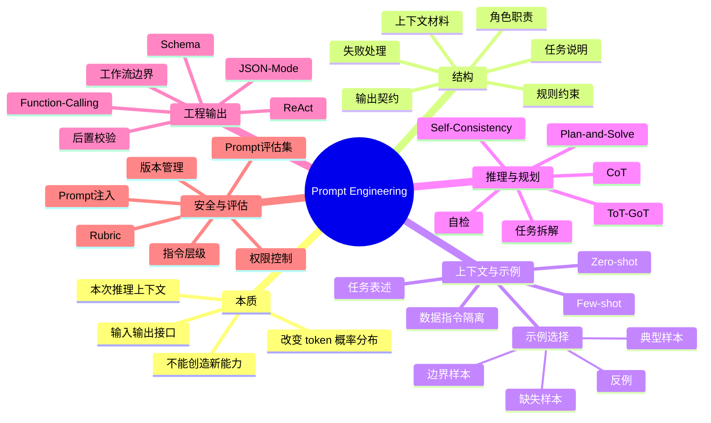

---
tags:
  - LLM
  - AI-Agent
  - Prompt-Engineering
  - 学习路线
created: 2026-05-24
updated: 2026-05-25
description: Prompt Engineering 索引与复习地图，按知识点链接到提示词结构、上下文示例、推理拆解、结构化输出、工具调用、安全与评估文档
---

# Prompt Engineering

> Prompt Engineering 不是“提示词咒语合集”，而是把任务目标、上下文、约束、示例、输出契约和评估方式组织成模型能遵循、系统能校验的输入接口。

---

# 1. 推荐阅读路径

```text
00 总览
  -> 01 Prompt 结构
  -> 02 上下文与示例
  -> 03 推理与拆解
  -> 04 结构化输出与工具调用
  -> 05 安全、评估与迭代
```

| 顺序 | 文档 | 核心问题 |
|---:|---|---|
| 0 | [[00-Prompt-Engineering-Overview|Prompt Engineering 总览]] | Prompt 为什么能改变模型输出，它能做什么、不能做什么？ |
| 1 | [[01-Prompt-Structure-And-Instructions|Prompt 结构与指令设计]] | 一个稳定 prompt 应该包含哪些部分？指令怎样写才可执行？ |
| 2 | [[02-Context-Examples-And-Task-Framing|上下文、示例与任务表述]] | Zero-shot、Few-shot、上下文材料和任务表述分别在改变什么？ |
| 3 | [[03-Reasoning-Decomposition-And-Planning|推理、拆解与规划]] | 多步任务如何拆解，CoT、自检、多候选各自适合什么场景？ |
| 4 | [[04-Structured-Output-Tool-Use-And-Workflows|结构化输出、工具调用与工作流]] | 如何让模型输出可被程序消费的结果，并受控调用工具？ |
| 5 | [[05-Prompt-Safety-Evaluation-And-Iteration|Prompt 安全、评估与迭代]] | 如何防 prompt 注入，如何用评估集持续改 prompt？ |

如果只做业务应用开发，优先读 `00、01、02、04、05`。如果准备 Agent 面试或复杂任务编排，再重点读 `03、04、05`。

---

# 2. 按知识点索引

## 2.1 先理解 Prompt 的本质和边界

| 知识点 | 去哪里看 | 要记住什么 |
|---|---|---|
| Prompt 为什么有效 | [[00-Prompt-Engineering-Overview#1. 核心问题：Prompt 为什么能影响模型行为|00 - Prompt 为什么能影响模型行为]] | Prompt 是本次推理上下文，会改变后续 token 概率分布 |
| Prompt 不是咒语 | [[00-Prompt-Engineering-Overview#2. Prompt 不是咒语，而是输入接口|00 - Prompt 不是咒语，而是输入接口]] | 好 prompt 更像输入输出接口定义，而不是华丽话术 |
| Prompt 有效来源 | [[00-Prompt-Engineering-Overview#3. Prompt 有效的三个来源|00 - Prompt 有效的三个来源]] | 模式迁移、指令遵循、输出空间压缩 |
| 工程位置 | [[00-Prompt-Engineering-Overview#4. Prompt 的工程位置|00 - Prompt 的工程位置]] | Prompt 只是链路一环，还要有解析、校验、工具、评估 |
| 能力边界 | [[00-Prompt-Engineering-Overview#5. Prompt 能做什么，不能做什么|00 - Prompt 能做什么，不能做什么]] | Prompt 能引导已有能力，不能可靠创造新能力 |
| 设计闭环 | [[00-Prompt-Engineering-Overview#6. Prompt 设计的最小闭环|00 - Prompt 设计的最小闭环]] | 定义任务、测试样本、分类失败、回归验证 |

## 2.2 Prompt 结构：从一句请求变成任务说明书

| 知识点 | 去哪里看 | 要记住什么 |
|---|---|---|
| Prompt 五层结构 | [[01-Prompt-Structure-And-Instructions#1. 核心问题：一个 prompt 应该包含什么|01 - 一个 prompt 应该包含什么]] | 身份与目标、任务、上下文、规则、输出、失败处理 |
| 任务说明 | [[01-Prompt-Structure-And-Instructions#2. 任务说明：先说清楚要完成的动作|01 - 任务说明]] | 用明确动词定义任务：判断、提取、分类、总结、审核 |
| 角色设定 | [[01-Prompt-Structure-And-Instructions#3. 角色设定：定义职责，不是换皮肤|01 - 角色设定]] | 角色要定义职责和判断标准，不是只写“你是专家” |
| 上下文材料 | [[01-Prompt-Structure-And-Instructions#4. 上下文材料：让模型知道依据在哪里|01 - 上下文材料]] | 指令、资料、用户输入要分区 |
| 规则约束 | [[01-Prompt-Structure-And-Instructions#5. 规则约束：写可执行规则，而不是愿望|01 - 规则约束]] | “每个结论引用资料编号”比“回答要准确”更可执行 |
| 输出契约 | [[01-Prompt-Structure-And-Instructions#6. 输出契约：让答案能被消费|01 - 输出契约]] | 字段、类型、缺失值、额外解释都要说明 |
| 失败处理 | [[01-Prompt-Structure-And-Instructions#7. 失败处理：提前定义不知道怎么办|01 - 失败处理]] | 不知道、冲突、越权时要有明确输出路径 |
| Prompt 模板 | [[01-Prompt-Structure-And-Instructions#8. Prompt 模板骨架|01 - Prompt 模板骨架]] | 模板的价值在槽位背后的任务思考 |

## 2.3 上下文、示例和任务表述

| 知识点 | 去哪里看 | 要记住什么 |
|---|---|---|
| 上下文三类 | [[02-Context-Examples-And-Task-Framing#1. 核心问题：模型到底从上下文里学到了什么|02 - 模型从上下文里学到了什么]] | 任务上下文、知识上下文、行为上下文 |
| Zero-shot | [[02-Context-Examples-And-Task-Framing#2. Zero-shot：不提供示例，靠任务说明完成|02 - Zero-shot]] | 靠任务说明完成，适合常见、简单、规则少的任务 |
| Few-shot | [[02-Context-Examples-And-Task-Framing#3. Few-shot：用示例定义任务分布|02 - Few-shot]] | 示例定义输入输出形态、类别边界和缺失处理 |
| 示例选择 | [[02-Context-Examples-And-Task-Framing#4. 好示例比多示例重要|02 - 好示例比多示例重要]] | 典型正例、边界样本、缺失信息样本、反例 |
| 示例误导 | [[02-Context-Examples-And-Task-Framing#5. 示例也会误导模型|02 - 示例也会误导模型]] | 示例格式不一致或和规则冲突，会强烈带偏输出 |
| 任务表述 | [[02-Context-Examples-And-Task-Framing#6. 任务表述：把用户愿望改写成可执行目标|02 - 任务表述]] | 把“帮我看看”改成审阅维度和输出标准 |
| 上下文组织 | [[02-Context-Examples-And-Task-Framing#7. 上下文组织：让模型更容易找到关键材料|02 - 上下文组织]] | 先给任务，再给材料，关键规则可在输出前重复 |
| 数据与指令隔离 | [[02-Context-Examples-And-Task-Framing#8. 数据和指令要分开|02 - 数据和指令要分开]] | 用户输入和外部资料是数据，不应覆盖系统规则 |

## 2.4 推理、拆解和规划

| 知识点 | 去哪里看 | 要记住什么 |
|---|---|---|
| 复杂任务为什么要拆 | [[03-Reasoning-Decomposition-And-Planning#1. 核心问题：为什么复杂任务需要拆解|03 - 为什么复杂任务需要拆解]] | 降低一步到位时遗漏约束、状态混乱和过早结论的风险 |
| Chain-of-Thought | [[03-Reasoning-Decomposition-And-Planning#2. Chain-of-Thought：让模型显式经过中间推理|03 - Chain-of-Thought]] | 适合数学、逻辑、多条件判断，不适合所有任务 |
| 任务拆解 | [[03-Reasoning-Decomposition-And-Planning#3. 任务拆解：把大问题变成小决策|03 - 任务拆解]] | 把大目标拆成有判断标准的小问题 |
| Plan-and-Solve | [[03-Reasoning-Decomposition-And-Planning#4. Plan-and-Solve：先计划，再执行|03 - Plan-and-Solve]] | 先建任务结构，再执行，必要时允许调整计划 |
| 自检与批判 | [[03-Reasoning-Decomposition-And-Planning#5. 自检与批判：让模型按标准检查输出|03 - 自检与批判]] | 自检必须有检查清单，不能只写“检查一下” |
| Self-Consistency | [[03-Reasoning-Decomposition-And-Planning#6. Self-Consistency：多条路径投票|03 - Self-Consistency]] | 多条独立路径投票，降低偶然错误但增加成本 |
| ToT / GoT | [[03-Reasoning-Decomposition-And-Planning#7. Tree-of-Thoughts 和 Graph-of-Thoughts：搜索多个中间状态|03 - ToT 和 GoT]] | 本质是生成多个中间状态、评价、剪枝、回溯 |
| 复杂任务模板 | [[03-Reasoning-Decomposition-And-Planning#8. 复杂任务 prompt 模板|03 - 复杂任务 prompt 模板]] | 目标、已知条件、阶段处理、检查清单、输出格式 |

## 2.5 结构化输出、工具调用和工作流

| 知识点 | 去哪里看 | 要记住什么 |
|---|---|---|
| 结构化输出为什么重要 | [[04-Structured-Output-Tool-Use-And-Workflows#1. 核心问题：为什么结构化输出很重要|04 - 为什么结构化输出很重要]] | 程序需要可解析、可校验的数据，不只是自然语言 |
| 约束层次 | [[04-Structured-Output-Tool-Use-And-Workflows#2. 从弱约束到强约束|04 - 从弱约束到强约束]] | Prompt、模板、JSON mode、schema、约束解码、校验重试 |
| Schema 设计 | [[04-Structured-Output-Tool-Use-And-Workflows#3. Schema 设计：把模糊输出变成契约|04 - Schema 设计]] | 能枚举就枚举，缺失用 null，高风险字段带证据 |
| 后置校验和重试 | [[04-Structured-Output-Tool-Use-And-Workflows#4. 后置校验和重试：不要相信第一次输出|04 - 后置校验和重试]] | parse、schema validate、business validate、有限重试 |
| Function Calling | [[04-Structured-Output-Tool-Use-And-Workflows#5. Function Calling：让模型生成工具调用参数|04 - Function Calling]] | 模型生成结构化请求，系统决定是否执行 |
| 工具 schema | [[04-Structured-Output-Tool-Use-And-Workflows#6. 工具 schema 要面向模型理解|04 - 工具 schema]] | 工具说明要写清用途、边界、参数含义和不能做什么 |
| ReAct | [[04-Structured-Output-Tool-Use-And-Workflows#7. ReAct：推理和行动交替|04 - ReAct]] | 决策、工具调用、观察结果、继续决策，必须有预算和停止条件 |
| 工作流边界 | [[04-Structured-Output-Tool-Use-And-Workflows#8. 工作流 prompt：让模型只负责合适的环节|04 - 工作流 prompt]] | 模型做语言理解和模糊决策，确定性动作交给程序 |

## 2.6 安全、评估和迭代

| 知识点 | 去哪里看 | 要记住什么 |
|---|---|---|
| Prompt 注入 | [[05-Prompt-Safety-Evaluation-And-Iteration#1. 核心问题：Prompt 为什么会被攻击|05 - Prompt 为什么会被攻击]] | 不可信数据伪装成高优先级指令 |
| 指令层级 | [[05-Prompt-Safety-Evaluation-And-Iteration#2. 指令层级：先分清谁能下命令|05 - 指令层级]] | 系统规则、开发者规则、用户请求、外部资料要分层 |
| 分隔符边界 | [[05-Prompt-Safety-Evaluation-And-Iteration#3. 分隔符有用，但不够|05 - 分隔符有用，但不够]] | 分隔符帮助识别边界，但不能单独保证安全 |
| 常见攻击面 | [[05-Prompt-Safety-Evaluation-And-Iteration#4. 常见攻击面|05 - 常见攻击面]] | 用户注入、RAG 文档注入、工具结果注入、prompt 泄露、越权工具调用 |
| 安全 prompt | [[05-Prompt-Safety-Evaluation-And-Iteration#5. 安全 prompt 的基本写法|05 - 安全 prompt 的基本写法]] | 外部资料不可信，高风险动作需确认，不泄露隐藏上下文 |
| Prompt eval | [[05-Prompt-Safety-Evaluation-And-Iteration#6. Prompt 评估：不要凭感觉改 prompt|05 - Prompt 评估]] | 收集样本、标注规则、批量运行、分类失败、回归测试 |
| 评估指标 | [[05-Prompt-Safety-Evaluation-And-Iteration#7. 评估指标：按任务选，不要只看主观好坏|05 - 评估指标]] | 分类、抽取、RAG、工具调用、安全分别看不同指标 |
| 版本管理 | [[05-Prompt-Safety-Evaluation-And-Iteration#8. Prompt 版本管理|05 - Prompt 版本管理]] | 记录 prompt、模型、参数、工具 schema、评估集版本 |

---

# 3. 思维导图



---

# 4. 一页复习图

```text
用户真实意图
  │
  ├─► 任务定义：到底要判断、提取、生成、审核还是规划？
  │
  ├─► 上下文：模型完成任务需要哪些材料？
  │
  ├─► 示例：是否需要用 few-shot 定义边界和格式？
  │
  ├─► 约束：哪些行为允许，哪些行为禁止？
  │
  ├─► 输出契约：自然语言、Markdown、JSON、schema、tool call？
  │
  ├─► 失败处理：不知道、冲突、越权、工具失败时怎么办？
  │
  ├─► 校验执行：parse、validate、retry、tool permission、audit
  │
  └─► 评估迭代：黄金集、失败分类、版本管理、回归测试
```

记忆主线：

```text
先定任务，再给材料；
示例定边界，规则定约束；
输出要契约，失败要路径；
复杂任务先拆解，工具调用要校验；
外部数据不可信，改 prompt 要评估。
```

---

# 5. 高频概念对照

| 概念 | 本质 | 常见误区 | 推荐阅读 |
|---|---|---|---|
| System Prompt | 高优先级行为边界和职责说明 | 写成“你是专家”就结束 | [[01-Prompt-Structure-And-Instructions]] |
| Role Playing | 激活某类文本模式和回答角度 | 等同于专业能力 | [[01-Prompt-Structure-And-Instructions#3. 角色设定：定义职责，不是换皮肤|角色设定]] |
| Zero-shot | 只靠任务说明完成 | 适合所有任务 | [[02-Context-Examples-And-Task-Framing#2. Zero-shot：不提供示例，靠任务说明完成|Zero-shot]] |
| Few-shot | 用示例定义局部任务分布 | 示例越多越好 | [[02-Context-Examples-And-Task-Framing#3. Few-shot：用示例定义任务分布|Few-shot]] |
| CoT | 显式或隐式经过中间推理 | 所有任务都加“逐步思考” | [[03-Reasoning-Decomposition-And-Planning#2. Chain-of-Thought：让模型显式经过中间推理|CoT]] |
| Self-Consistency | 多路径生成后投票或选择 | 一定更准且无代价 | [[03-Reasoning-Decomposition-And-Planning#6. Self-Consistency：多条路径投票|Self-Consistency]] |
| JSON Mode | 通常保证 JSON 语法合法 | 保证业务 schema 正确 | [[04-Structured-Output-Tool-Use-And-Workflows#2. 从弱约束到强约束|约束层次]] |
| Function Calling | 生成受控工具调用参数 | 模型真的执行工具 | [[04-Structured-Output-Tool-Use-And-Workflows#5. Function Calling：让模型生成工具调用参数|Function Calling]] |
| ReAct | 推理和行动交替 | 没有循环和权限风险 | [[04-Structured-Output-Tool-Use-And-Workflows#7. ReAct：推理和行动交替|ReAct]] |
| Prompt Injection | 不可信输入伪装成指令 | 加分隔符即可解决 | [[05-Prompt-Safety-Evaluation-And-Iteration#1. 核心问题：Prompt 为什么会被攻击|Prompt 注入]] |
| Prompt Eval | 用样本和规则评估 prompt | 凭感觉比较输出即可 | [[05-Prompt-Safety-Evaluation-And-Iteration#6. Prompt 评估：不要凭感觉改 prompt|Prompt 评估]] |

---

# 6. 面试速查

| 如果被问到 | 回答主线 | 去哪里复习 |
|---|---|---|
| Prompt Engineering 的本质是什么？ | 设计本次推理上下文，引导模型使用已有能力，不改变参数 | [[00-Prompt-Engineering-Overview]] |
| 好 prompt 怎么写？ | 角色职责、任务说明、上下文、规则、输出契约、失败处理 | [[01-Prompt-Structure-And-Instructions]] |
| Zero-shot 和 Few-shot 区别？ | 是否用示例定义任务分布；Few-shot 适合边界和格式特殊任务 | [[02-Context-Examples-And-Task-Framing]] |
| CoT 为什么有效？ | 让复杂任务经过中间状态，降低一步到位遗漏约束的概率 | [[03-Reasoning-Decomposition-And-Planning]] |
| 结构化输出如何保证稳定？ | Prompt < JSON mode < schema/function calling < 约束解码 < 校验重试 | [[04-Structured-Output-Tool-Use-And-Workflows]] |
| 工具调用中模型和系统分别负责什么？ | 模型生成调用意图和参数；系统校验权限、执行工具、记录审计 | [[04-Structured-Output-Tool-Use-And-Workflows]] |
| Prompt 注入怎么防？ | 指令层级、数据隔离、工具最小权限、敏感信息隔离、攻击样本评估 | [[05-Prompt-Safety-Evaluation-And-Iteration]] |
| 怎么证明 prompt 改得更好？ | 构建评估集，定义指标，批量运行，分类失败，做回归测试 | [[05-Prompt-Safety-Evaluation-And-Iteration]] |

---

# 7. 与其他目录的边界

- [[../LLM-Basic/README|LLM 基础]]：模型如何生成、解码参数、上下文窗口、评估基础。
- [[../RAG/README|RAG]]：如何检索外部知识并把证据放进上下文。
- Fine-tuning：通过训练改变模型参数；Prompt 只改变本次推理输入。
- Agent：把 Planning、Memory、Tool Use、Action 组合成多步系统；Prompt 是模型与这些组件交互的接口。

一句话区分：

> Prompt 负责“怎么让模型做这次任务”，RAG 负责“给模型哪些证据”，工具系统负责“能不能执行动作”，评估负责“结果到底靠不靠谱”。

---

# 8. 延伸搜索清单

下面这些属于细枝末节或进阶方向，主线掌握后再查：

- prompt compression
- automatic prompt optimization
- soft prompt / prefix tuning
- prompt ensembling
- prompt chaining
- constitutional AI
- adversarial prompting
- jailbreak benchmark
- prompt leakage
- instruction hierarchy
- XML prompting
- DSPy
- Guidance / Outlines / LMQL
- constrained decoding
- semantic router
- synthetic data for prompt eval
- rubric-based LLM judge
- retrieval prompt injection
- multi-agent debate prompting
- Reflexion / LATS / Tree-of-Thoughts / Graph-of-Thoughts

