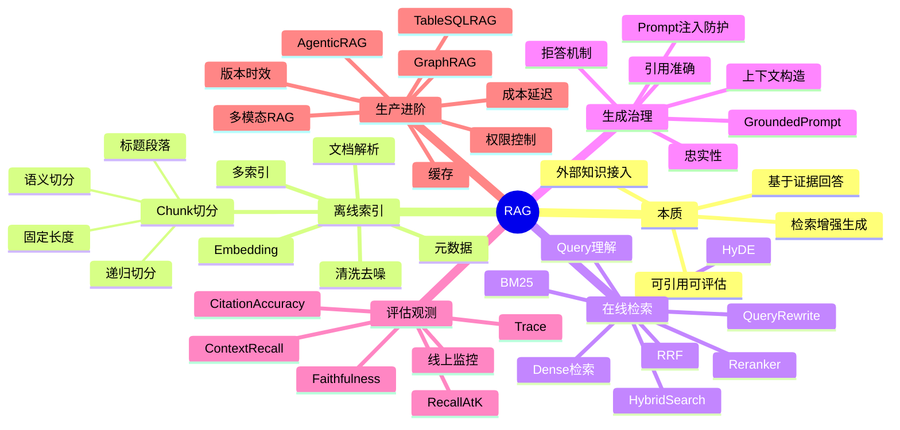

---
tags:
  - LLM
  - AI-Agent
  - RAG
  - 学习路线
created: 2026-05-25
updated: 2026-05-25
description: RAG 索引与复习地图，按知识点链接到检索增强生成、文档处理、Embedding、混合检索、重排、生成、评估与生产化文档
---

# RAG

> RAG（Retrieval-Augmented Generation，检索增强生成）不是“向量数据库 + LLM”的简单拼接，而是一套把外部知识处理成可检索证据、把证据送入上下文、再让模型基于证据回答并可评估追踪的工程链路。

---

# 1. 推荐阅读路径

```text
00 总览
  -> 01 文档处理与索引
  -> 02 Embedding 与向量检索
  -> 03 混合检索、重排与查询改写
  -> 04 基于证据生成、引用与幻觉治理
  -> 05 RAG 评估与可观测性
  -> 06 生产级 RAG 与进阶模式
```

| 顺序 | 文档 | 核心问题 |
|---:|---|---|
| 0 | [[00-RAG-Overview|RAG 总览]] | RAG 解决什么问题，为什么它不是“向量库 + prompt”？ |
| 1 | [[01-Document-Processing-And-Indexing|文档处理与索引构建]] | 文档如何从原始文件变成可检索、可引用、可更新的知识单元？ |
| 2 | [[02-Embeddings-And-Vector-Retrieval|Embedding 与向量检索]] | 向量检索为什么能找语义相关内容，它的边界在哪里？ |
| 3 | [[03-Hybrid-Retrieval-Reranking-And-Query-Rewriting|混合检索、重排与查询改写]] | 为什么只靠 dense retrieval 不够，如何提高召回和排序质量？ |
| 4 | [[04-Grounded-Generation-Citations-And-Hallucination-Control|基于证据生成、引用与幻觉治理]] | 找到材料后，如何让模型忠实使用证据回答？ |
| 5 | [[05-RAG-Evaluation-And-Observability|RAG 评估与可观测性]] | RAG 失败时如何定位是检索、上下文、生成还是引用的问题？ |
| 6 | [[06-Production-RAG-And-Advanced-Patterns|生产级 RAG 与进阶模式]] | 权限、版本、缓存、GraphRAG、Agentic RAG 等如何放进工程系统？ |

如果只做业务应用，优先读 `00、01、03、04、05`。如果要做知识库平台或 RAG 基础设施，再重点读 `02、06`。

---

# 2. 按知识点索引

## 2.1 先理解 RAG 的本质和边界

| 知识点 | 去哪里看 | 要记住什么 |
|---|---|---|
| 为什么需要 RAG | [[00-RAG-Overview#1. 核心问题：为什么需要 RAG|00 - 为什么需要 RAG]] | LLM 参数知识可能过时、缺私有数据、不可溯源，RAG 用检索证据补足 |
| 最小链路 | [[00-RAG-Overview#2. RAG 的最小链路|00 - RAG 的最小链路]] | 离线索引链路 + 在线问答链路 |
| RAG 解决什么 | [[00-RAG-Overview#3. RAG 解决了什么|00 - RAG 解决了什么]] | 私有知识、新鲜知识、可溯源回答、低成本知识更新 |
| RAG 没解决什么 | [[00-RAG-Overview#4. RAG 没解决什么|00 - RAG 没解决什么]] | RAG 提供证据，不提供真理；不替代数据治理、权限和工具 |
| 失败模式 | [[00-RAG-Overview#5. RAG 的典型失败模式|00 - RAG 的典型失败模式]] | 索引失败、召回失败、排序失败、生成失败 |
| 工程定位 | [[00-RAG-Overview#6. RAG 的工程定位|00 - RAG 的工程定位]] | RAG 找证据，Prompt 组织证据，LLM 基于证据生成 |
| 最小可用系统 | [[00-RAG-Overview#7. 一个最小可用 RAG 系统|00 - 一个最小可用 RAG 系统]] | 入库、检索、重排、引用、日志、失败样本迭代缺一不可 |

## 2.2 文档处理与索引构建

| 知识点 | 去哪里看 | 要记住什么 |
|---|---|---|
| 文档处理为什么重要 | [[01-Document-Processing-And-Indexing#1. 核心问题：为什么文档处理这么重要|01 - 为什么文档处理重要]] | RAG 质量上限常在入库时决定 |
| 文档解析 | [[01-Document-Processing-And-Indexing#2. 文档解析：先保住结构|01 - 文档解析]] | 不只是提取文字，还要保住标题、表格、页码、代码块等结构 |
| 清洗 | [[01-Document-Processing-And-Indexing#3. 清洗：去噪但不要误删信息|01 - 清洗]] | 去掉干扰检索的噪声，保留能支撑答案和引用的结构 |
| Chunk | [[01-Document-Processing-And-Indexing#4. Chunk：检索的基本单元|01 - Chunk]] | chunk 应包含回答某类问题所需的最小完整语义 |
| 切分策略 | [[01-Document-Processing-And-Indexing#5. 常见切分策略|01 - 常见切分策略]] | 固定长度、标题段落、递归、语义切分各有适用场景 |
| Overlap | [[01-Document-Processing-And-Indexing#6. Overlap：为什么要重叠|01 - Overlap]] | 避免答案被切在边界，但会增加重复和索引成本 |
| Parent-Child Chunk | [[01-Document-Processing-And-Indexing#7. Parent-Child Chunk：小片段召回，大片段生成|01 - Parent-Child Chunk]] | 小 chunk 精确召回，大 parent 提供完整上下文 |
| 元数据 | [[01-Document-Processing-And-Indexing#8. 元数据：不要只存文本和向量|01 - 元数据]] | 来源、标题、页码、权限、时间、版本决定引用和过滤 |
| 多索引 | [[01-Document-Processing-And-Indexing#9. 索引不止一种|01 - 索引不止一种]] | 向量、关键词、元数据、全文和原文存储要配合 |
| 增量更新 | [[01-Document-Processing-And-Indexing#10. 增量更新和删除|01 - 增量更新和删除]] | 知识库会变化，必须处理新增、更新、删除、版本和权限变化 |

## 2.3 Embedding 与向量检索

| 知识点 | 去哪里看 | 要记住什么 |
|---|---|---|
| Embedding 表示什么 | [[02-Embeddings-And-Vector-Retrieval#1. 核心问题：Embedding 到底表示什么|02 - Embedding 到底表示什么]] | 把文本映射到语义向量空间，相近语义距离更近 |
| 向量相似度 | [[02-Embeddings-And-Vector-Retrieval#2. 向量相似度：如何判断接近|02 - 向量相似度]] | Cosine、Dot Product、Euclidean 都是排序方式 |
| Dense Retrieval 优势 | [[02-Embeddings-And-Vector-Retrieval#3. Dense Retrieval 的优势|02 - Dense Retrieval 的优势]] | 擅长同义表达、模糊问法和语义泛化 |
| Dense Retrieval 边界 | [[02-Embeddings-And-Vector-Retrieval#4. Dense Retrieval 的边界|02 - Dense Retrieval 的边界]] | 不擅长错误码、数字、版本、否定和细微条件 |
| 向量检索流程 | [[02-Embeddings-And-Vector-Retrieval#5. 向量检索的基本流程|02 - 向量检索流程]] | query embedding 与 chunk embedding 做近邻搜索 |
| ANN | [[02-Embeddings-And-Vector-Retrieval#6. ANN：为什么需要近似最近邻|02 - ANN]] | 用一点召回损失换速度和内存 |
| 向量数据库 | [[02-Embeddings-And-Vector-Retrieval#7. 向量数据库到底做什么|02 - 向量数据库]] | 管索引和查询，不负责文档可信、权限语义和答案正确 |
| Embedding 模型选择 | [[02-Embeddings-And-Vector-Retrieval#8. Embedding 模型怎么选|02 - Embedding 模型怎么选]] | 看语言、领域、维度、上下文长度、成本、部署和业务评估集 |
| Query-Document mismatch | [[02-Embeddings-And-Vector-Retrieval#9. Query 和 Document 不一定同分布|02 - Query 和 Document 不一定同分布]] | 用户问题短且口语，文档正式且完整，需要改写、扩展或重排 |

## 2.4 混合检索、重排与查询改写

| 知识点 | 去哪里看 | 要记住什么 |
|---|---|---|
| 为什么只靠向量不够 | [[03-Hybrid-Retrieval-Reranking-And-Query-Rewriting#1. 核心问题：为什么只靠向量检索不够|03 - 为什么只靠向量检索不够]] | 业务问题常含关键词、编号、数字、时间和过滤条件 |
| BM25 | [[03-Hybrid-Retrieval-Reranking-And-Query-Rewriting#2. BM25：关键词检索为什么仍然重要|03 - BM25]] | 稀有词、错误码、型号、法条编号等精确匹配很重要 |
| Hybrid Search | [[03-Hybrid-Retrieval-Reranking-And-Query-Rewriting#3. Hybrid Search：语义和关键词一起用|03 - Hybrid Search]] | dense + BM25 + metadata 合并候选，提高召回鲁棒性 |
| RRF | [[03-Hybrid-Retrieval-Reranking-And-Query-Rewriting#4. RRF：按排名融合|03 - RRF]] | 多路排名融合，不要求不同检索器分数同尺度 |
| Reranker | [[03-Hybrid-Retrieval-Reranking-And-Query-Rewriting#5. Reranker：为什么重排常常有效|03 - Reranker]] | cross-encoder 能细判 query-doc 是否真正支持答案 |
| 召回和重排权衡 | [[03-Hybrid-Retrieval-Reranking-And-Query-Rewriting#6. 召回和重排的权衡|03 - 召回和重排的权衡]] | 调召回候选数、rerank 候选数、最终上下文片段数 |
| Query Rewriting | [[03-Hybrid-Retrieval-Reranking-And-Query-Rewriting#7. Query Rewriting：用户问题不等于检索查询|03 - Query Rewriting]] | 补全指代、加入上下文、改写成文档术语 |
| Multi-query Retrieval | [[03-Hybrid-Retrieval-Reranking-And-Query-Rewriting#8. Multi-query Retrieval：多路问法召回|03 - Multi-query Retrieval]] | 生成多个问法提高召回，但成本和噪声上升 |
| HyDE | [[03-Hybrid-Retrieval-Reranking-And-Query-Rewriting#9. HyDE：先生成假设答案再检索|03 - HyDE]] | 用假设答案贴近文档表达，适合开放语义检索 |
| 元数据过滤 | [[03-Hybrid-Retrieval-Reranking-And-Query-Rewriting#10. 元数据过滤：先缩小正确范围|03 - 元数据过滤]] | 权限、租户、产品、时间、版本应在检索前或检索中处理 |

## 2.5 基于证据生成、引用与幻觉治理

| 知识点 | 去哪里看 | 要记住什么 |
|---|---|---|
| 检索到了不等于会用对 | [[04-Grounded-Generation-Citations-And-Hallucination-Control#1. 核心问题：检索到了不等于会用对|04 - 检索到了不等于会用对]] | 相关片段不一定支持结论，模型也可能混入参数知识 |
| 上下文构造 | [[04-Grounded-Generation-Citations-And-Hallucination-Control#2. 上下文构造：给模型什么材料|04 - 上下文构造]] | 去重、排序、压缩、补标题、来源、冲突标记、引用编号 |
| 证据顺序与噪声 | [[04-Grounded-Generation-Citations-And-Hallucination-Control#3. 证据顺序和上下文噪声|04 - 证据顺序和上下文噪声]] | 相关性、权威性、新版本、权限和上下文噪声都影响答案 |
| Grounded Prompt | [[04-Grounded-Generation-Citations-And-Hallucination-Control#4. Grounded Prompt：明确要求基于证据|04 - Grounded Prompt]] | 只基于资料、关键结论引用、资料不足拒答、冲突说明 |
| 引用准确 | [[04-Grounded-Generation-Citations-And-Hallucination-Control#5. 引用：从“有引用”到“引用支持结论”|04 - 引用准确]] | 引用要支持 claim，不是答案末尾装饰 |
| 忠实性 | [[04-Grounded-Generation-Citations-And-Hallucination-Control#6. 忠实性：答案是否被上下文支持|04 - 忠实性]] | 答案中的关键声明必须能从上下文推出 |
| 拒答机制 | [[04-Grounded-Generation-Citations-And-Hallucination-Control#7. 拒答机制：不知道时如何回答|04 - 拒答机制]] | 资料不足、冲突、无权限、工具不可用时要允许“不知道” |
| Context Compression | [[04-Grounded-Generation-Citations-And-Hallucination-Control#8. Context Compression：上下文放不下怎么办|04 - Context Compression]] | 压缩能省上下文，但可能丢证据或改原意 |
| RAG prompt 注入 | [[04-Grounded-Generation-Citations-And-Hallucination-Control#9. RAG 中的 prompt 注入|04 - RAG 中的 prompt 注入]] | 检索资料是数据，不是指令；外部资料默认不可信 |

## 2.6 评估与可观测性

| 知识点 | 去哪里看 | 要记住什么 |
|---|---|---|
| 分层评估 | [[05-RAG-Evaluation-And-Observability#1. 核心问题：RAG 评估要定位失败环节|05 - RAG 评估要定位失败环节]] | 同一个错答案可能来自索引、召回、排序、上下文、生成或引用 |
| 评估集 | [[05-RAG-Evaluation-And-Observability#2. 构建 RAG 评估集|05 - 构建 RAG 评估集]] | query、期望答案、golden docs、过滤条件、是否应拒答 |
| 检索评估 | [[05-RAG-Evaluation-And-Observability#3. 检索评估：正确证据有没有被找回|05 - 检索评估]] | Recall@k、Precision@k、MRR、nDCG、Hit Rate |
| 上下文评估 | [[05-RAG-Evaluation-And-Observability#4. 上下文评估：放进 prompt 的材料是否有用|05 - 上下文评估]] | Context Recall、Context Precision、Noise Ratio、Conflict Rate |
| 生成评估 | [[05-RAG-Evaluation-And-Observability#5. 生成评估：答案是否正确且忠实|05 - 生成评估]] | correctness 和 faithfulness 要分开看 |
| 引用评估 | [[05-RAG-Evaluation-And-Observability#6. 引用评估：引用是否支撑结论|05 - 引用评估]] | claim-evidence 对齐，比“有引用”更重要 |
| 端到端评估 | [[05-RAG-Evaluation-And-Observability#7. 端到端评估：用户看到的结果是否有用|05 - 端到端评估]] | 解决问题、拒答质量、引用、延迟、成本 |
| LLM-as-a-Judge | [[05-RAG-Evaluation-And-Observability#8. LLM-as-a-Judge 怎么用|05 - LLM-as-a-Judge]] | 要有 rubric，要用人工样本校准 |
| Trace | [[05-RAG-Evaluation-And-Observability#9. 可观测性：记录完整 trace|05 - 可观测性]] | 记录 query、改写、召回、分数、上下文、prompt、答案、引用和反馈 |
| 线上监控 | [[05-RAG-Evaluation-And-Observability#10. 线上监控|05 - 线上监控]] | 空召回、拒答、引用覆盖、延迟、成本、安全、漂移 |

## 2.7 生产级 RAG 与进阶模式

| 知识点 | 去哪里看 | 要记住什么 |
|---|---|---|
| demo 到生产差异 | [[06-Production-RAG-And-Advanced-Patterns#1. 核心问题：从 demo 到生产差在哪里|06 - 从 demo 到生产差在哪里]] | 生产要处理权限、版本、更新、延迟、成本、攻击和复盘 |
| 权限控制 | [[06-Production-RAG-And-Advanced-Patterns#2. 权限控制：不能让模型看到不该看的资料|06 - 权限控制]] | 未授权内容不应进入模型上下文 |
| 版本和时效性 | [[06-Production-RAG-And-Advanced-Patterns#3. 版本和时效性|06 - 版本和时效性]] | active/deprecated、更新时间、权威来源、历史时间条件 |
| 缓存 | [[06-Production-RAG-And-Advanced-Patterns#4. 缓存：降低成本但要小心过期|06 - 缓存]] | cache key 要考虑用户权限、知识库版本、prompt 和模型版本 |
| 成本延迟 | [[06-Production-RAG-And-Advanced-Patterns#5. 成本和延迟优化|06 - 成本和延迟优化]] | 优化 query rewrite、embedding、retrieval、rerank、compression、generation |
| GraphRAG | [[06-Production-RAG-And-Advanced-Patterns#6. GraphRAG：什么时候需要图|06 - GraphRAG]] | 适合多跳关系、实体关系、全局总结，不是所有场景都需要 |
| Agentic RAG | [[06-Production-RAG-And-Advanced-Patterns#7. Agentic RAG：让模型参与检索决策|06 - Agentic RAG]] | 模型决定是否检索、检索什么、是否二次检索；需预算和停止条件 |
| Multi-modal RAG | [[06-Production-RAG-And-Advanced-Patterns#8. Multi-modal RAG|06 - Multi-modal RAG]] | OCR、layout、表格、图表、图片区域引用都是难点 |
| Table / SQL RAG | [[06-Production-RAG-And-Advanced-Patterns#9. Table RAG 和 SQL RAG|06 - Table RAG 和 SQL RAG]] | 表格计算应交给 SQL、BI 或程序，不要让模型硬读长表 |
| RAG + Agent | [[06-Production-RAG-And-Advanced-Patterns#10. RAG 和 Agent 的组合|06 - RAG 和 Agent 的组合]] | RAG 可以作为 Agent 的知识工具，但知识源边界要清楚 |

---

# 3. 思维导图



---

# 4. 一页复习图

```text
离线索引链路
原始文档
  │
  ├─► 解析：保留标题、表格、代码、页码、链接、来源
  ├─► 清洗：去噪但不误删条款、编号、表格语义
  ├─► 切分：让 chunk 成为最小完整语义单元
  ├─► 元数据：权限、版本、时间、来源、标题路径
  ├─► Embedding：把 chunk 映射成向量
  └─► 索引：向量、关键词、元数据、全文、原文存储

在线问答链路
用户问题
  │
  ├─► 查询理解：补全指代、提取过滤条件、必要时 query rewrite
  ├─► 多路召回：dense、BM25、metadata、multi-query、HyDE
  ├─► 重排融合：RRF、reranker、去重、过滤
  ├─► 上下文构造：证据编号、标题来源、压缩、冲突标记
  ├─► Grounded generation：只基于证据回答，资料不足就拒答
  ├─► 引用校验：claim 是否被 citation 支持
  └─► 观测评估：trace、指标、反馈、失败样本回流
```

记忆主线：

```text
先入库，再召回；
先找全，再排准；
相似不等于证据；
有引用不等于引用正确；
答案正确不等于忠实；
权限不能交给模型；
没有 trace，就没有可调试的 RAG。
```

---

# 5. 高频概念对照

| 概念 | 本质 | 常见误区 | 推荐阅读 |
|---|---|---|---|
| RAG | 检索外部证据增强生成 | 等于向量数据库 | [[00-RAG-Overview]] |
| Chunk | 检索和上下文构造的基本单元 | size 有统一标准答案 | [[01-Document-Processing-And-Indexing#4. Chunk：检索的基本单元|Chunk]] |
| Overlap | 避免边界切断语义 | 越大越好 | [[01-Document-Processing-And-Indexing#6. Overlap：为什么要重叠|Overlap]] |
| Metadata | 来源、版本、权限、标题路径等结构信息 | 只存文本和向量即可 | [[01-Document-Processing-And-Indexing#8. 元数据：不要只存文本和向量|元数据]] |
| Embedding | 文本的语义向量表示 | 相似度高就能回答 | [[02-Embeddings-And-Vector-Retrieval]] |
| ANN | 近似最近邻索引 | 完全不影响召回 | [[02-Embeddings-And-Vector-Retrieval#6. ANN：为什么需要近似最近邻|ANN]] |
| BM25 | 关键词稀疏检索 | 已被向量检索淘汰 | [[03-Hybrid-Retrieval-Reranking-And-Query-Rewriting#2. BM25：关键词检索为什么仍然重要|BM25]] |
| Hybrid Search | 多路召回融合 | dense 和 BM25 分数直接相加即可 | [[03-Hybrid-Retrieval-Reranking-And-Query-Rewriting#3. Hybrid Search：语义和关键词一起用|Hybrid Search]] |
| Reranker | 对候选片段做精细相关性排序 | 能弥补召回失败 | [[03-Hybrid-Retrieval-Reranking-And-Query-Rewriting#5. Reranker：为什么重排常常有效|Reranker]] |
| Query Rewrite | 把用户问题改成适合检索的查询 | 一定提升检索效果 | [[03-Hybrid-Retrieval-Reranking-And-Query-Rewriting#7. Query Rewriting：用户问题不等于检索查询|Query Rewriting]] |
| Grounding | 答案受证据约束 | 检索到了就自然会用对 | [[04-Grounded-Generation-Citations-And-Hallucination-Control]] |
| Citation | claim 到 evidence 的可追溯连接 | 答案末尾放来源即可 | [[04-Grounded-Generation-Citations-And-Hallucination-Control#5. 引用：从“有引用”到“引用支持结论”|引用准确]] |
| Faithfulness | 答案是否被上下文支持 | 和答案正确性是一回事 | [[05-RAG-Evaluation-And-Observability#5. 生成评估：答案是否正确且忠实|生成评估]] |
| GraphRAG | 用实体关系图增强检索和综合 | 所有 RAG 都应该上图 | [[06-Production-RAG-And-Advanced-Patterns#6. GraphRAG：什么时候需要图|GraphRAG]] |
| Agentic RAG | 模型参与检索决策和多轮检索 | 更灵活就一定更好 | [[06-Production-RAG-And-Advanced-Patterns#7. Agentic RAG：让模型参与检索决策|Agentic RAG]] |

---

# 6. 面试速查

| 如果被问到 | 回答主线 | 去哪里复习 |
|---|---|---|
| RAG 的本质是什么？ | 推理前检索外部证据，把相关材料放入上下文，让模型基于证据生成 | [[00-RAG-Overview]] |
| RAG 为什么不只是向量数据库？ | 还包括文档处理、元数据、混合检索、重排、上下文构造、引用和评估 | [[00-RAG-Overview]] |
| chunk size 怎么选？ | 看文档结构和任务，通过召回、忠实性和噪声评估调参 | [[01-Document-Processing-And-Indexing]] |
| Dense retrieval 和 BM25 区别？ | Dense 看语义，BM25 看词项；生产常用 hybrid 互补 | [[02-Embeddings-And-Vector-Retrieval]]、[[03-Hybrid-Retrieval-Reranking-And-Query-Rewriting]] |
| Reranker 为什么有效？ | 它让 query 和 doc 交互判断，能区分主题相关和真正支持答案 | [[03-Hybrid-Retrieval-Reranking-And-Query-Rewriting]] |
| 如何降低 RAG 幻觉？ | 提高证据质量，使用 grounded prompt，关键结论引用，资料不足拒答，做忠实性评估 | [[04-Grounded-Generation-Citations-And-Hallucination-Control]] |
| RAG 评估怎么做？ | 分检索、上下文、生成、引用、端到端和线上监控几层看 | [[05-RAG-Evaluation-And-Observability]] |
| 生产级 RAG 要注意什么？ | 权限、版本、增量更新、缓存、延迟成本、trace、安全和失败样本回流 | [[06-Production-RAG-And-Advanced-Patterns]] |
| GraphRAG 什么时候需要？ | 多跳关系、实体依赖、全局总结等普通 chunk retrieval 难处理时 | [[06-Production-RAG-And-Advanced-Patterns#6. GraphRAG：什么时候需要图|GraphRAG]] |
| 长上下文能否替代 RAG？ | 不能完全替代；长上下文解决放得下，RAG 解决找得准、权限、版本、引用和评估 | [[06-Production-RAG-And-Advanced-Patterns#11. 常见误区|生产级常见误区]] |

---

# 7. 与其他目录的边界

- [[../LLM-Basic/README|LLM 基础]]：模型如何生成、上下文窗口、解码参数、评估基础。
- [[../Prompt-Engineering/README|Prompt Engineering]]：如何组织任务、上下文、规则和输出契约，让模型正确使用检索材料。
- Fine-tuning：通过训练改变模型参数；RAG 不改参数，而是在推理时补充外部知识。
- Agent：把 RAG 当作知识工具之一，与 Planning、Memory、Action 组合成多步系统。

一句话区分：

> RAG 负责“找证据”，Prompt 负责“让模型怎么用证据”，工具系统负责“执行动作”，评估负责“判断证据和答案是否真的对上”。

---

# 8. 延伸搜索清单

下面这些先不用背，等主链路理解后再搜索：

- HyDE
- Multi-query retrieval
- RAG Fusion
- Reciprocal Rank Fusion
- ColBERT / late interaction
- SPLADE
- Parent Document Retriever
- Contextual retrieval
- Semantic chunking
- Proposition-based chunking
- GraphRAG
- RAPTOR
- Self-RAG
- Corrective RAG
- Adaptive RAG
- Agentic RAG
- CRAG
- Long-context RAG
- Multi-modal RAG
- Table RAG
- SQL RAG / Text-to-SQL
- Time-aware retrieval
- ACL-aware retrieval
- Prompt injection in RAG
- RAGAS / TruLens / DeepEval
- Embedding drift
- ANN index: HNSW / IVF / PQ

