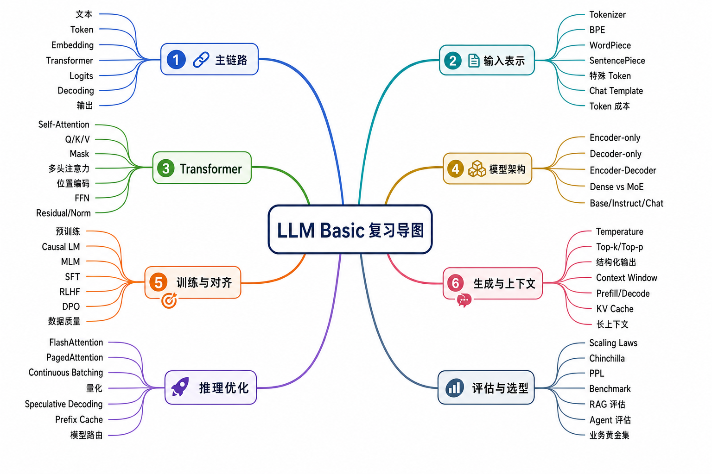
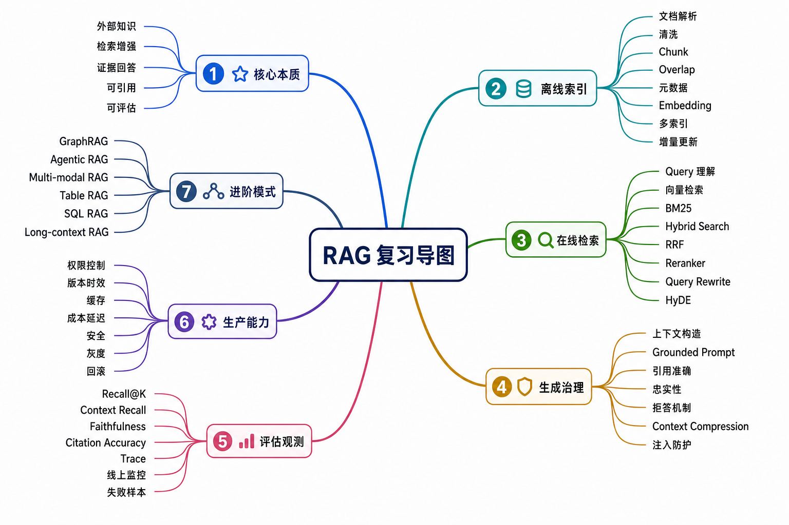

# Agent 八股目录

> AI Agent 应用开发岗的核心面试知识体系。

---

## 1. 大语言模型（LLM）基础
- [[LLM-Basic/README|LLM 基础目录]]：学习顺序、面试复习地图、与其他目录的边界

- [[LLM-Basic/00-LLM-Overview|LLM 总览]]：从 token 到 logits 的完整链路、训练与推理区别、能力边界
- [[LLM-Basic/01-Transformer|Transformer]]：Self-Attention、Multi-Head Attention、位置编码、FFN、Norm、KV Cache
- [[LLM-Basic/02-Tokenizer-Embedding|Tokenizer 与 Embedding]]：BPE、WordPiece、SentencePiece、特殊 token、词表与 token 成本
- [[LLM-Basic/03-LLM-Variants|主流模型架构差异]]：GPT、BERT、T5、Llama、Qwen、DeepSeek、Dense vs MoE
- [[LLM-Basic/04-Training-Objectives|训练目标与对齐]]：预训练、MLM、Causal LM、SFT、RLHF、DPO、数据质量
- [[LLM-Basic/05-Generation-Strategies|生成策略]]：Greedy、Beam Search、Top-k、Top-p、Temperature、惩罚项、结构化输出
- [[LLM-Basic/06-Context-Window-KV-Cache|上下文窗口与 KV Cache]]：prefill、decode、长上下文成本、上下文管理
- [[LLM-Basic/07-Length-Extrapolation|长度外推]]：RoPE、ALiBi、NTK-aware、YaRN、位置插值、滑动窗口注意力
- [[LLM-Basic/08-Inference-Optimization|推理优化]]：FlashAttention、PagedAttention、连续批处理、量化、投机解码
- [[LLM-Basic/09-Scaling-Laws|Scaling Laws]]：参数量、数据量、算力、Chinchilla、涌现能力、模型路由
- [[LLM-Basic/10-Model-Evaluation|模型评估]]：Perplexity、Benchmark、RAG/Agent 评估、LLM-as-a-Judge、线上监控

## 2. 提示词工程（Prompt Engineering）
- [[Prompt-Engineering/README|Prompt Engineering 目录]]：学习顺序、核心主线、面试复习地图、延伸搜索清单
- [[Prompt-Engineering/00-Prompt-Engineering-Overview|Prompt Engineering 总览]]：prompt 为什么有效、工程位置、能力边界、最小迭代闭环
- [[Prompt-Engineering/01-Prompt-Structure-And-Instructions|Prompt 结构与指令设计]]：任务说明、角色职责、上下文分区、规则约束、输出契约
- [[Prompt-Engineering/02-Context-Examples-And-Task-Framing|上下文、示例与任务表述]]：Zero-shot、Few-shot、示例选择、上下文组织、上下文污染
- [[Prompt-Engineering/03-Reasoning-Decomposition-And-Planning|推理、拆解与规划]]：CoT、任务拆解、Plan-and-Solve、自检、Self-Consistency、ToT/GoT
- [[Prompt-Engineering/04-Structured-Output-Tool-Use-And-Workflows|结构化输出、工具调用与工作流]]：JSON/Schema、Function Calling、校验重试、ReAct、Agent 工作流
- [[Prompt-Engineering/05-Prompt-Safety-Evaluation-And-Iteration|Prompt 安全、评估与迭代]]：Prompt 注入、指令层级、权限控制、黄金集、版本管理

## 3. RAG（检索增强生成）
- [[RAG/README|RAG 目录]]：学习顺序、核心主线、面试复习地图、延伸搜索清单

- [[RAG/00-RAG-Overview|RAG 总览]]：检索增强生成的完整链路、能力边界、失败模式和工程定位
- [[RAG/01-Document-Processing-And-Indexing|文档处理与索引构建]]：解析清洗、chunk、overlap、元数据、多索引和增量更新
- [[RAG/02-Embeddings-And-Vector-Retrieval|Embedding 与向量检索]]：语义向量、相似度、ANN、向量数据库、embedding 模型选择
- [[RAG/03-Hybrid-Retrieval-Reranking-And-Query-Rewriting|混合检索、重排与查询改写]]：BM25、Hybrid Search、RRF、Reranker、Multi-query、HyDE
- [[RAG/04-Grounded-Generation-Citations-And-Hallucination-Control|基于证据生成、引用与幻觉治理]]：上下文构造、忠实性、引用准确、拒答、RAG 注入防护
- [[RAG/05-RAG-Evaluation-And-Observability|RAG 评估与可观测性]]：检索指标、上下文指标、忠实性、引用评估、trace 和线上监控
- [[RAG/06-Production-RAG-And-Advanced-Patterns|生产级 RAG 与进阶模式]]：权限、版本、缓存、GraphRAG、Agentic RAG、多模态和表格 RAG

## 4. 模型微调（Fine-tuning）
- [[Fine-tuning/README|Fine-tuning 目录]]：学习顺序、核心主线、面试复习地图、延伸搜索清单
- [[Fine-tuning/00-Fine-Tuning-Overview|Fine-tuning 总览]]：微调定位、适用边界、主要类型、完整流程、常见失败模式
- [[Fine-tuning/01-Data-Design-And-Formatting|数据设计与格式]]：数据质量、指令格式、chat template、loss mask、数据划分、合成数据
- [[Fine-tuning/02-SFT-And-Instruction-Tuning|SFT 与指令微调]]：监督微调目标、assistant loss、训练参数、过拟合、灾难性遗忘
- [[Fine-tuning/03-PEFT-LoRA-QLoRA-And-Adapters|PEFT、LoRA、QLoRA 与 Adapter]]：低秩适配、关键超参、量化训练、合并部署和适用边界
- [[Fine-tuning/04-Preference-Alignment-RLHF-DPO-And-RM|偏好对齐、RLHF、DPO 与 Reward Model]]：偏好数据、奖励模型、PPO、DPO、KTO/ORPO 和对齐风险
- [[Fine-tuning/05-Training-Systems-And-Optimization|训练工程与优化]]：显存构成、混合精度、优化器、ZeRO/FSDP、checkpoint、稳定性排查
- [[Fine-tuning/06-Evaluation-Deployment-And-Iteration|评估、部署与迭代]]：离线评估、回归测试、安全评估、灰度上线、监控和版本管理

## 5. Agent
- [[Agent/README|Agent 目录]]：学习顺序、核心主线、复习地图、延伸搜索清单
- [[Agent/00-Agent-Overview|Agent 总览]]：Agent 本质、边界、最小闭环、适用场景和常见失败模式
- [[Agent/01-Agent-Loop-Planning-And-State|Agent 循环、规划与状态]]：Observe-Plan-Act、ReAct、任务拆解、重规划、状态管理和停止条件
- [[Agent/02-Tool-Use-And-Action-Execution|工具使用与行动执行]]：Function Calling、工具 schema、Tool Gateway、参数校验、幂等和沙箱
- [[Agent/03-Memory-Context-And-Knowledge|记忆、上下文与知识]]：短期记忆、工作状态、长期记忆、RAG、上下文压缩和记忆治理
- [[Agent/04-Workflow-Human-In-The-Loop-And-Safety|工作流、人工介入与安全边界]]：状态机、checkpoint、human-in-the-loop、权限、prompt injection 和审计
- [[Agent/05-Agent-Frameworks-And-Engineering|框架选择与工程化落地]]：LangChain、LangGraph、多 Agent 框架、低代码平台、手写 workflow 和生产能力
- [[Agent/06-Agent-Evaluation-Observability-And-Operations|评估、可观测性与运营]]：任务成功率、过程指标、trace、评估集、线上监控、成本和运营闭环
- [[Agent/07-Advanced-Agent-Patterns|进阶模式与协作范式]]：Reflection、Self-Refine、Tree of Thoughts、多 Agent、Agentic RAG 和模式取舍
