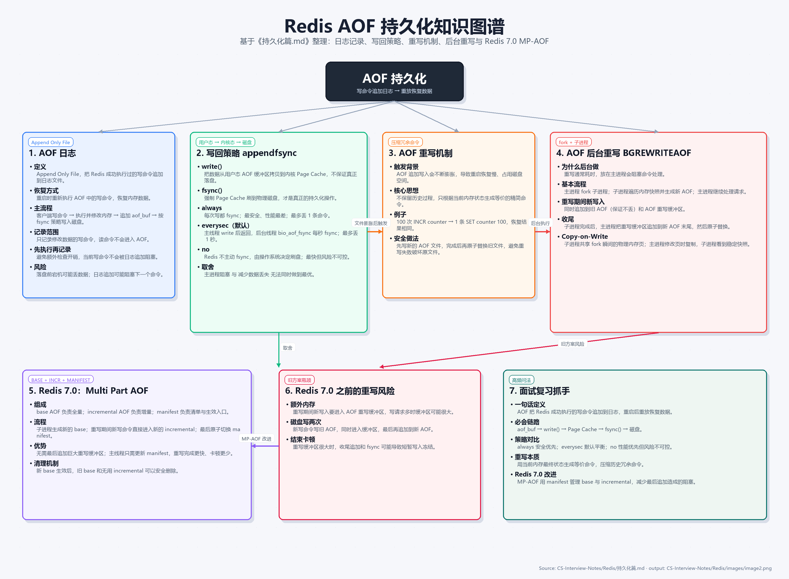

# AOF持久化
## AOF日志

AOF，全称 **Append Only File**，中文一般叫**追加日志文件**。把 Redis 执行过的“写命令”记录到文件里。Redis 重启时，再把这些命令重新执行一遍，从而恢复数据。
开启AOF后，Redis的工作，流程是：
```
客户端发送写命令
   ↓
Redis 执行命令，修改内存数据
   ↓
Redis 把写命令追加到 AOF 缓冲区
   ↓
根据 fsync 策略，把 AOF 写入磁盘
```
注意AOF**只会记录修改数据的**命令，而记录读命令。
Redis是先执行写操作命令后，才将命令记录到AOF日志中，这么做的好处主要有：
1、**避免额外的检查开销**。如果采用先写日志的方式，写入AOF后命令执行失败，就需要额外处理日志回滚或标记无效，增加复杂度。
2、**不会阻塞当前写命令的执行**。命令执行和日志追加分离，主线程响应更快。
但这么做也有坏处：
1、**数据丢失风险**。命令执行完成后、AOF写入磁盘前，如果Redis宕机，这条命令就会丢失。
2、**可能给下一个命令带来阻塞**。因为写操作时在当前命令执行成功后进行，所以当前命令不会被阻塞，但是下一个命令需要等待写入完成后。

## 写回策略

Redis 提供了三种 AOF 写回（fsync）策略，由 `appendfsync` 参数控制：

| 策略 | 说明 | 优点 | 缺点 | 数据丢失范围 |
|------|------|------|------|-------------|
| `always` | 每次写命令都同步刷盘 | 最安全，几乎不丢数据 | 性能最差，每次写都要磁盘 I/O | 最多 1 条命令 |
| `everysec` | 每秒批量刷盘一次（默认） | 性能与安全平衡 | 如果宕机，可能丢失最近 1 秒的数据 | 最多 1 秒数据 |
| `no` | 由操作系统决定何时刷盘 | 性能最好，主线程不阻塞 | 最不安全，宕机时丢失数据最多 | 不可控，可能丢失较多 |

**流程对比（用户态 → 内核态 → 磁盘）：**
```
客户端发送写命令
   ↓
Redis 执行命令，修改内存数据
   ↓
【用户态】Redis 把写命令追加到 AOF 缓冲区（server.aof_buf，用户空间内存）
   ↓
【用户态 → 内核态】调用 write() 系统调用
   ↓
【内核态】数据被拷贝到内核 Page Cache（页缓存），write() 返回
   │
   ├─ always：主线程立刻调用 fsync()/fdatasync()
   │           ↓
   │           强制将 Page Cache 刷到物理磁盘，阻塞等待完成
   │
   ├─ everysec：主线程直接返回，由后台线程（bio_aof_fsync）
   │             每秒执行一次 fsync()，把 Page Cache 刷盘
   │
   └─ no：主线程直接返回，不主动调用 fsync()
           由操作系统内核自行决定何时把 Page Cache 写回磁盘
```

**关键点：**
- `write()` 只把数据从**用户态**拷贝到**内核态的 Page Cache**，不保证落盘
- `fsync()` 才会强制把 **Page Cache 刷到物理磁盘**，是真正的持久化操作
- `always` 每次写都 `fsync()`，最安全但主线程阻塞在磁盘 I/O 上
- `everysec` 主线程只 `write()` 不 `fsync()`，刷盘交给后台线程，所以最多丢 1 秒
- `no` 连 `fsync()` 都不调用，完全依赖操作系统，性能最好但最不可控
这三种图协会策略都无法完美解决“主进程阻塞”和“减少数据丢失”的问题，因为这两个问题是队里的，偏向于一边的话，就要牺牲另一边。
## AOF重写机制

AOF 是一个追加写入的日志文件，随着执行的写操作命令越来越多，文件体积会不断膨胀。如果 AOF 文件过大，会带来两个明显问题：
1. **重启恢复慢**：Redis 重启时需要重新执行所有命令，文件越大恢复时间越长
2. **占用磁盘空间**：大量冗余命令（例如对同一个 key 反复修改）导致文件膨胀

**重写的核心思想**：AOF 记录的是操作过程，而 Redis 内存中最终只保留数据的最新状态。因此，不需要逐条保留历史命令，只需根据当前内存数据生成一组能恢复出同样结果的命令集合即可。

例如，对一个计数器执行了 100 次 `INCR`，AOF 原本记录了 100 条命令；重写后只需记录 1 条 `SET counter 100`，效果完全相同。

**AOF重写过程中是先写到一个新的AOF文件，重写完成后再覆盖原有文件。目的是避免重写失败，导致现有的AOF文件也无法使用，最终导致无法还原。**

## AOF后台重写

AOF日志的操作虽然是在主进程完成，但是因为他写入的内容不多，所以一般不太影响命令早错。但是在触发重写的时候，AOF文件一般比较大，这个过程很耗时，多一重写的操作不能放在主进程里。
为了避免重写过程阻塞主进程，Redis 使用 **BGREWRITEAOF** 命令在后台执行重写，流程如下：

```
主进程执行 BGREWRITEAOF
   ↓
主进程 fork() 出一个子进程
   ↓
子进程遍历当前内存数据，生成新的精简 AOF 文件
   │
   ├─ 在此期间，主进程继续处理客户端请求
   │   新写入的命令同时追加到：
   │   ① 旧的 AOF 文件（保证不丢数据）
   │   ② AOF 重写缓冲区（aof_rewrite_buf_blocks）
   │
子进程完成新 AOF 文件写入
   ↓
子进程通知主进程
   ↓
主进程把重写缓冲区中的增量命令追加到新 AOF 文件末尾
   ↓
原子替换旧 AOF 文件
```

**Copy-on-Write（写时复制）**
- fork 出的子进程与父进程共享同一片物理内存页
- 当主进程执行写命令时，被修改的内存页会复制一份给主进程专用，子进程看到的仍是 fork 瞬间的数据快照
- 这样子进程可以安全地遍历内存，而无需加锁，也不会阻塞主进程

**潜在风险**
**问题一：重写期间的新写入要占用额外内存**
重写期间，如果写请求很多，AOF 重写缓冲区可能很大。
比如重写耗时 30 秒，而这 30 秒里产生了大量写请求：
```
SET ...HSET ...ZADD ...INCR ...LPUSH ...
```
这些命令既要正常写旧 AOF，又要临时保存在内存缓冲区中。
Redis 官方文档也提到，Redis 7.0 之前，如果 rewrite 期间数据库有写入，AOF 可能会使用大量内存，因为这些写入要先缓存在内存里，最后再写入新 AOF。

**问题二：重写期间的新写入会写两次磁盘**
Redis 7.0 之前，重写期间的新写命令通常会：
```
写入旧 AOF同时进入重写缓冲区最后再追加到新 AOF
```
也就是同一批新写入可能产生额外磁盘写入。
官方文档也指出，Redis 7.0 之前，rewrite 期间到来的所有写命令会被写入磁盘两次。

**问题三：重写结束时可能短暂卡顿**
当子进程生成新 AOF 后，主进程需要把重写缓冲区追加到新 AOF 末尾。
如果缓冲区很大，这一步可能带来明显延迟。
官方文档也提到，Redis 7.0 之前，rewrite 结束时 Redis 可能会因为写入和 `fsync` 这些命令到新 AOF 文件而出现写入冻结。
## Redis7.0引入的Multi Part AOF

Redis 7.0 之前，重写期间需要维护一个重写缓冲区，并在最后将增量数据追加到新文件，这个过程在数据量很大时仍有阻塞风险。

Redis 7.0 引入了 **Multi Part AOF（MP-AOF）**，将 AOF 文件拆分为多个部分：

```
base AOF 文件
incremental AOF 文件
manifest 清单文件
```
大致的流程可以表示为：
```
1. Redis 主进程 fork 出子进程
2. 子进程根据当前内存快照生成新的 base AOF 临时文件
3. 主进程不再把新写入塞进巨大的重写缓冲区而是打开一个新的 incremental AOF 文
4. 重写期间的新写命令直接写入新的 incremental AOF
5. 子进程完成 base AOF 后通知主进程
6. 主进程生成临时 manifest 文件
7. 原子切换 manifest，让新的 base + incremental 生效
8. 清理旧 base 和无用 incremental 文件
```
**优势：**
1. **无需最后追加**：子进程重写完成后，直接把新的 BASE 文件和已有的 INCR 文件一起写入 manifest，不需要把重写缓冲区的大量数据拷贝到新文件末尾
2. **更快的重写完成**：主线程只需更新 manifest 文件即可原子切换，避免了单个大文件的阻塞式替换
3. **更清晰的结构**：BASE 负责全量，INCR 负责增量，便于管理和清理

**清理机制**：当新的 BASE 生成后，旧的 BASE 和已被包含的 INCR 文件可以被安全删除。

## 总结



AOF 的核心是把 Redis 已经成功执行的写命令追加到日志文件中，Redis 重启后通过重新执行这些命令来恢复数据。它只记录会修改数据的命令，不记录读命令；并且采用“先执行命令，再写日志”的方式，这样可以避免命令执行失败后还要处理日志回滚，也不会阻塞当前写命令本身，但会带来落盘前宕机导致数据丢失、日志写入阻塞后续命令的风险。

AOF 写入链路可以概括为：写命令执行成功后进入 AOF 缓冲区，然后通过 `write()` 从用户态拷贝到内核的 Page Cache，最后再根据 `appendfsync` 策略决定何时调用 `fsync()` 刷到物理磁盘。`always` 每次写都刷盘，安全性最高但性能最差；`everysec` 每秒刷盘一次，是默认的折中方案，最多可能丢失 1 秒数据；`no` 完全交给操作系统决定刷盘时机，性能最好但数据丢失范围最不可控。

随着写命令不断追加，AOF 文件会越来越大，导致重启恢复变慢、磁盘占用增加。因此 Redis 提供 AOF 重写机制：不再保留冗余历史命令，而是根据当前内存中的最终数据状态生成一份等价但更精简的新 AOF 文件，例如多次 `INCR` 可以重写成一条 `SET`。为了避免重写阻塞主进程，Redis 使用 `BGREWRITEAOF` 让子进程在后台基于 fork 时的内存快照生成新文件，主进程继续处理请求，并通过 Copy-on-Write 保证子进程看到稳定的数据视图。

Redis 7.0 之前，后台重写期间的新写命令既要写入旧 AOF，又要进入 AOF 重写缓冲区，最后还要追加到新 AOF，这会带来额外内存占用、重复磁盘写入以及重写结束时的短暂卡顿。Redis 7.0 引入 Multi Part AOF，把 AOF 拆成 `base AOF`、`incremental AOF` 和 `manifest`：base 负责全量数据，incremental 负责重写期间的增量命令，manifest 负责原子切换生效，从而减少最后追加大缓冲区带来的阻塞风险。


# RDB持久化
RDB，全称可以理解为 **Redis Database Snapshot**，中文一般叫 **快照持久化**。
它的核心思想是：
> 在某个时间点，把 Redis 内存中的全部数据保存成一个二进制文件，默认文件名通常是 `dump.rdb`。Redis 重启时，再把这个文件加载回内存。

## RDB的生成
Redis 生成 RDB，常见方式是后台生成，也就是 `BGSAVE`。
大致流程是：
```
Redis 主进程
   ↓ fork
Redis 子进程
   ↓
子进程把内存快照写入临时 RDB 文件
   ↓
写完后，用新的 RDB 文件替换旧的 RDB 文件
```
Redis 官方文档描述 RDB 生成过程时也说：Redis 会 `fork`，子进程把数据集写入临时 RDB 文件，完成后替换旧文件；这个方法利用了操作系统的 copy-on-write 机制。注意，这里的快照都是全量快照，所以可以认为生成RDB快照是一个比较重的任务。

## RDB的数据修改

RDB使用了写时复制的技术，子进程和父进程共享物理内存空间，当父进程修改时，赋值修改的内存部分。子进程只保存fork那一刻的系统快照，对fork之后的修改不进行保存。

## RDB和AOF混合使用

开启混合持久化后，在进行持久化操作时，Redis会fork子进程进行持久化。子进程会保存当前的RDB快照作为持久化文件的前半部分，fork后的增量内容，则被主进程写进缓存区，后形成AOF格式，放在持久化文件的后半部分。