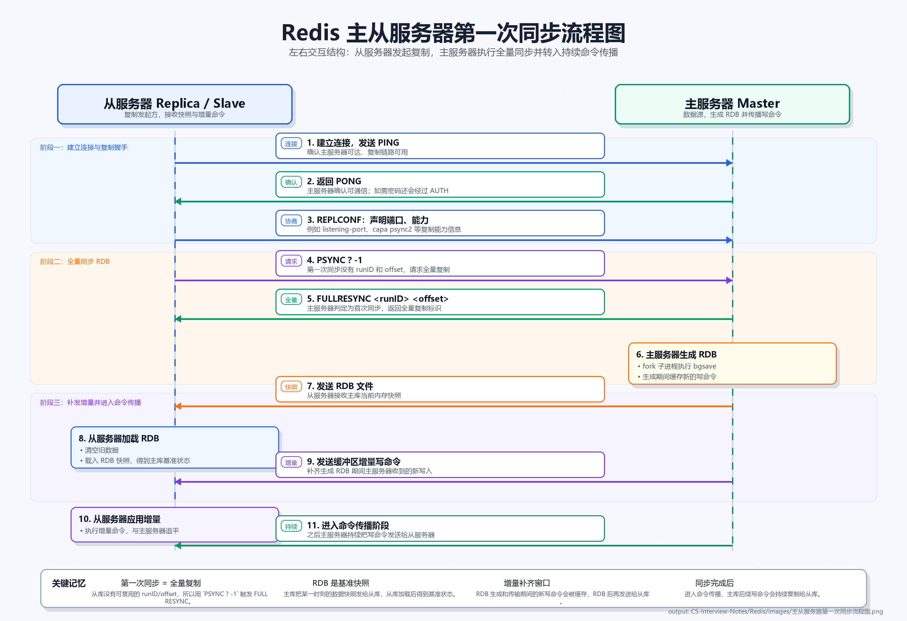

# Redis 高可用

如果所有服务都依赖单个 Redis 实例，一旦该实例宕机，整个服务都会变得不可用；如果服务器硬件损坏，还可能导致严重的数据丢失。

因此需要引入多节点机制，让多台服务器保存相同或相关的数据，类似磁盘阵列中的冗余思想。围绕 Redis 高可用，核心问题主要有：

- 数据如何在多台服务器之间同步？
- 到底由哪台服务器对外提供服务？
- 提供服务的服务器故障后，如何进行故障转移？
- 故障服务器恢复后，应该如何重新加入系统？

Redis 主要通过三类机制解决这些问题：

- **主从复制**：解决数据备份和读写分离问题。
- **哨兵模式**：解决主节点故障后的自动监控和自动故障转移问题。
- **集群模式**：解决单实例容量上限和集群级高可用问题。

## 主从复制

主从复制用于保证数据尽量一致，并且主从节点通常采用读写分离模式：

- **主服务器**：执行写操作，也可以执行读操作。
- **从服务器**：一般只读，接收主服务器同步过来的写命令，并执行这些命令来保持数据一致。

配置从节点时，可以使用：

```bash
replicaof 192.168.1.10 6379
```

含义是：

```text
当前 Redis 实例复制 192.168.1.10:6379 这个主节点
```

### 第一次同步



第一次同步通常是**全量同步**，大致分为三个阶段。

#### Step 1：建立连接，协商同步

执行 `replicaof` 命令后，主从关系确定。从节点会向主节点发送 `psync` 命令，表示要进行数据同步。

`psync` 命令包含两个参数：

- **runID**：主服务器的唯一标识符。每个 Redis 服务器启动时都会自动生成一个 40 位十六进制随机字符串。从节点通过 runID 判断之前复制的是否仍然是当前这台主节点。如果 runID 不同，说明主节点可能重启过，或者从节点连接到了其他主节点，需要触发全量复制。
- **offset**：复制偏移量，表示主节点累计发送给从节点的字节位置。主从节点各自维护 offset，通过对比 offset 可以判断数据是否一致。从节点会在 `psync` 中上报自己的 offset，主节点检查该 offset 是否仍在复制积压缓冲区（replication backlog）内：如果在，则触发增量复制；如果不在，则触发全量复制。

主服务器收到 `psync` 后，会判断是否可以进行增量同步。如果不行，就进行全量同步。第一次同步时通常无法增量同步，因此主节点会返回 `FULLRESYNC`，表示接下来进行全量复制。

#### Step 2：主服务器同步数据给从服务器

主服务器会执行 `bgsave` 命令，生成 RDB 快照，并将 RDB 快照发送给从节点。

这里会引出一个问题：**生成和发送 RDB 快照期间，新产生的写命令怎么办？**

主服务器会把这段时间产生的新写命令缓存到缓冲区中，包括：

- 生成 RDB 快照时产生的写命令；
- 发送 RDB 快照时产生的写命令；
- 从服务器加载 RDB 快照时产生的写命令。

#### Step 3：同步新写入命令

从服务器加载 RDB 快照完成后，会向主服务器上报完成。随后主服务器把缓冲区中的写命令发送给从服务器，从服务器执行这些命令，完成数据追平。

这个过程仍然可能存在极短时间窗口内的新命令尚未传递，但整体上已经足够接近一致。

### 命令传播

主从服务器完成第一次同步后，会在二者之间建立一个长连接 TCP 连接。

后续主服务器会通过这个连接，将新的写命令持续传递给从服务器。从服务器执行这些命令，从而保持和主服务器的数据一致。

使用长连接的目的，是避免频繁建立 TCP 连接带来的额外系统开销。

### 压力分摊

主服务器可以挂载多个从服务器，但如果主服务器要同时和多个从服务器进行全量同步和命令传播，主服务器压力也会明显增加，甚至可能导致主进程被同步任务阻塞。

为了分摊主服务器压力，可以采用多级复制结构：

```text
主服务器
  ├── 从服务器 A
  │     ├── 孙服务器 A1
  │     └── 孙服务器 A2
  └── 从服务器 B
        └── 孙服务器 B1
```

在这种结构中：

- 主服务器把写命令同步给从服务器；
- 从服务器再把写命令同步给下一级“孙服务器”；
- 主服务器主要负责写操作，也可以处理读操作；
- 其余从节点主要负责读操作。

### 增量复制

如果主从服务器之间连接断开，连接恢复后就需要进行新一次同步。此时希望尽量使用增量同步，避免重新做一次开销很大的全量同步。

增量复制依赖两个关键点：

- 主服务器维护一个环形缓冲区 `repl_backlog_buffer`，用于保存最近传播过的写命令。
- 主从节点都维护自己的复制偏移量 `offset`，用于记录同步进度。

恢复连接时，主服务器会根据从服务器上报的 offset 判断缺失的写命令是否仍在环形缓冲区中：

- 如果缺失数据还在缓冲区中，就进行**增量复制**；
- 如果断连时间太长，缓冲区中的数据已经被覆盖，就需要重新进行**全量复制**。

因此，`repl_backlog_buffer` 的大小非常重要。缓冲区越大，断连后能进行增量复制的概率越高。

### 主从复制总结

主节点负责处理写入，并把数据变化以复制流的形式发送给从节点。从节点执行相同的数据变更，从而尽量保持和主节点一致。

主从复制解决的是**数据备份**和**读写分离**问题，但它本身并不能自动完成故障转移。

## 哨兵模式

主从复制解决了单个 Redis 实例宕机后无备用节点的问题：只要选择一个从节点作为新的主节点即可。

但这又引出了新的问题：

- 谁来监视并上报主节点状态？
- 主节点宕机后，选择哪个从节点作为新的主节点？
- 故障转移是手动完成，还是自动完成？
- 如果自动完成，具体流程是什么？

哨兵模式就是用来解决这些问题的。

### 哨兵模式工作机制

一个 Redis 主从架构通常会配置多个哨兵节点。哨兵主要负责：

- 监控主节点和从节点是否正常；
- 在主节点下线后，选择新的主服务器；
- 通知其他从节点切换到新的主服务器；
- 通知客户端主节点发生了变化。

### 故障判断

哨兵判断主节点故障通常分为两个阶段：**主观下线**和**客观下线**。

#### 主观下线

哨兵会每隔一秒向主服务器发送一次 `PING` 消息，主服务器正常情况下会回复 `PONG`。

如果在一定时间内，某个哨兵没有收到主服务器的回复，它就会认为主服务器下线，并将该主服务器标记为**主观下线**。

#### 客观下线

单个哨兵的判断可能不准确，因此该哨兵会向其他哨兵询问主服务器状态。

如果超过设定数量的哨兵都认为主服务器已经主观下线，那么该主服务器就会被认定为**客观下线**。随后，哨兵集群会启动故障转移流程。

### 故障转移

故障转移可以拆成两个核心问题：

- 哪个哨兵作为 leader 来执行故障转移？
- 哪个从节点会被选为新的主服务器？

#### Q1：确定哪个哨兵作为 leader

所有判断主服务器**主观下线**的哨兵，都可能成为候选人。之后哨兵之间开始投票，获得超过设定票数的哨兵会成为故障转移 leader。

投票过程大致如下：

- 每个哨兵会先给自己投一票；
- 随后向其他哨兵发送拉票请求；
- 每个哨兵会把自己的票投给第一个收到的合法请求方；
- 当某个候选哨兵拿到足够票数后，就成为 leader。

哨兵节点个数一般设置为奇数，并且通常至少部署 3 个节点，这样更容易形成多数派，避免选举僵持。

#### Q2：确定谁作为新的主服务器

选择新的主服务器时，哨兵 leader 会按下面的规则筛选从节点。

##### Step 1：过滤网络状态不好的从节点

Redis 维护了 `down-after-milliseconds` 配置项，表示主从节点断连的最大超时时间。如果从节点和主节点在该时间内没有恢复连接，就会被记录一次断连。

如果某个从节点断连次数过多，例如超过十次，就会被认为网络状态不佳。哨兵会优先过滤掉这类节点。

##### Step 2：比较从节点优先级

过滤后，哨兵会按照预先设置的优先级继续筛选从节点。

优先级越高，越优先被考虑为新的主节点。优先级通常可以根据服务器性能、部署位置等因素设置。

##### Step 3：比较复制进度

如果存在多个优先级相同的从节点，就比较它们的复制进度。

复制进度越靠前，说明该从节点与原主节点的数据越接近，因此越优先被选为新的主节点。

##### Step 4：比较 runID

如果仍然无法选出新主节点，就比较 Redis 实例的唯一 `runID`，选择 runID 最小的节点作为新的主节点。

### 故障转移流程

选出新的主节点后，故障转移流程如下：

1. 哨兵 leader 向被选中的从节点发送 `slaveof no one` 命令，让它升级为主节点。
2. leader 持续向该节点发送 `INFO` 命令，查看节点状态，直到它确认自己已经变成 `master`。
3. leader 向其他从节点发送 `slaveof` 命令，让它们改为复制新的主节点。
4. Redis 通过发布者/订阅者机制向客户端通知主节点更新消息。
5. 哨兵继续监视已经下线的旧主节点。如果旧主节点重新上线，会将它设置为当前主节点的从节点。

### 哨兵集群

哨兵通常是多个节点组成的集群。哨兵集群的形成依赖 Redis 的发布者/订阅者机制。

主节点上存在一个频道：

```text
__sentinel__:hello
```

哨兵之间通过这个频道互相发现：

1. 哨兵 A 把自己的 IP 和端口号发布到 `__sentinel__:hello` 频道。
2. 哨兵 B、C 订阅该频道后，就可以获取哨兵 A 的信息。
3. 哨兵 B、C 也会发布自己的信息，从而让其他哨兵发现自己。
4. 哨兵之间建立连接，形成哨兵网络。

同时，哨兵还会通过 `INFO` 命令从主节点获取从节点信息。这样，哨兵就可以逐渐形成完整的主从节点和哨兵节点视图。

## 集群模式

主从复制和哨兵模式解决了单实例 Redis 的可用性问题，但没有解决单实例容量上限问题。

例如，单台服务器最多只能容纳 64GB 数据。无论增加多少主从节点和哨兵节点，每个 Redis 实例存储的数据上限仍然受单机容量限制。

如果需要存储 128GB 数据，就可以考虑把数据拆成两个 64GB 分片，分别放在两个主节点上，每个主节点再配置自己的从节点。

这就是 Redis Cluster 要解决的问题：**通过分片扩展容量，同时提供集群级高可用能力**。

### 数据怎么分：哈希槽

Redis Cluster 设定了固定数量的哈希槽，共 **16384** 个。

Redis 会通过下面的方式计算 key 属于哪个槽：

```text
slot = CRC16(key) % 16384
```

每个 Redis 主节点负责维护一段槽。例如：

```text
节点 A：负责 1-3000 号槽
节点 B：负责 3001-6000 号槽
```

集群中的每个节点都会维护一份完整的“槽到节点”的映射表。

使用哈希槽的好处是：当集群节点数量变化时，可以只迁移一部分槽，减少数据迁移范围。

如果直接用当前集群节点数量作为取模值，一旦集群中服务器数量变化，大部分 key 的存放位置都会重新计算，迁移成本会非常高。

### 客户端如何知道应该访问哪个服务器

每个客户端都会维护一份“槽 - 节点”的映射表，并缓存到本地。

客户端访问某个 key 时，流程如下：

1. 使用哈希算法计算该 key 属于哪个槽。
2. 查询本地映射表，找到该槽归属于哪个节点。
3. 向对应节点发送请求。

### MOVED 重定向

客户端本地的映射表可能会因为集群变化而过期。Redis Cluster 使用 `MOVED` 重定向来更新客户端映射表。

流程如下：

1. 客户端根据本地映射表，认为槽 100 属于节点 A，于是向节点 A 发送请求。
2. 节点 A 收到请求后，发现槽 100 已经不归自己负责。
3. 节点 A 返回 `MOVED` 错误，错误中带上槽 100 当前对应节点的地址。
4. 客户端收到 `MOVED` 后，更新本地映射表。
5. 客户端重新向正确节点发送请求。

### ASK 重定向

还有一种情况：客户端访问的槽正在迁移。

例如，槽 100 正在从节点 A 迁移到节点 B。Redis 迁移槽时，是一个 key 一个 key 搬迁的，因此可能出现：

- 槽 100 的一部分 key 还在节点 A；
- 槽 100 的另一部分 key 已经在节点 B。

如果客户端仍按照原映射表向节点 A 请求，但请求的 key 已经迁移到节点 B，节点 A 会返回 `ASK` 错误，告诉客户端去问节点 B。

`ASK` 和 `MOVED` 的区别是：

- `MOVED`：表示槽的归属已经稳定变化，客户端需要更新本地映射表。
- `ASK`：表示槽正在迁移，客户端只临时访问目标节点，不更新本地映射表。

收到 `ASK` 后，客户端会向节点 B 发送 `ASKING` 请求，表示：

```text
虽然这个槽现在不归你负责，但我要访问的 key 临时在你这里，请帮我处理这次请求。
```

### 节点之间怎么同步信息

Redis Cluster 节点之间通过 Gossip 协议通信。

集群状态是动态变化的，可能存在节点上线、节点下线、主从切换等情况。因此节点之间需要不断交换信息。

Gossip 的基本过程是：

1. 节点周期性地随机挑选几个节点进行通信。
2. 节点把自己知道的集群状态发送给对方。
3. 所有节点都持续进行这样的信息交换。
4. 经过几轮传播后，整个集群的状态逐渐收敛到一致。

Gossip 的优点：

- 实现简单；
- 去中心化，避免单点故障。

Gossip 的缺点：

- 信息传播存在一定延迟；
- 随着节点数量增加，Gossip 消息量会快速增长，带来更高的通信开销。

集群中常见消息包括：

| 消息 | 作用 |
| --- | --- |
| `PING` | 节点周期性地向其他节点发送，携带自己知道的集群状态。 |
| `PONG` | 节点收到 `PING` 后返回，也会携带自己知道的集群状态。 |
| `MEET` | 集群新增节点时，老节点向新节点发送 `MEET`，帮助新节点加入集群。 |
| `FAIL` | 当某个节点被判定为下线时，向集群广播 `FAIL`，通知其他节点更新状态。 |

集群通信使用的端口通常是 Redis 服务端口加 10000。

### 节点挂了怎么办

Redis Cluster 中也有主从复制机制。集群中的从节点通常不直接对外提供服务，收到请求时会返回 `MOVED`，要求客户端访问对应主节点。

如果客户端需要从从节点读取数据，可以通过 `READONLY` 命令开启只读访问模式。

Redis Cluster 推荐的最小部署规模是**三主三从**。

#### 故障判断

集群中的节点会互相发送 `PING` / `PONG` 消息。

如果节点 A 向节点 B 发送 `PING`，但在一定时间内没有收到 `PONG`，节点 A 会在本地把节点 B 标记为**主观下线**，即 `PFAIL`。

`PFAIL` 状态会随着 Gossip 传播。如果集群中半数以上拥有槽的主节点都认为节点 B 主观下线，那么节点 B 会被判定为**客观下线**，即 `FAIL`。

随后，会有节点向整个集群广播 `FAIL` 消息，通知大家把该节点状态更新为下线。

#### 故障转移

主节点下线后，它的从节点需要发起选举，选出新的主节点。

选举流程如下：

1. 如果某个从节点与主节点断连时间太长，该从节点没有资格参与竞选。
2. 数据同步进度越新的从节点，等待发起选举的时间越短。
3. 等待时间结束后，从节点发起选举，请求持有槽的主节点给自己投票。
4. 持有槽的主节点会把票投给第一个收到的合法拉票请求方。
5. 如果某个从节点拿到了半数以上的票，它就会升级为新的主节点。

## Redis 分布式锁的高可用和高性能

现在几乎所有的后端都是分布式系统，数据一致性是所有后端工程师都需要面对的核心挑战。而保证一致性，锁是很重要的工具。锁确保在多线程或多节点环境下，某个关键资源在同一时刻只能被一个执行单元访问。
在分布式系统中，分布式锁和分布式事务是很重要两个部分。

## 加锁

任何支持“排他性操作”的中间件都可以设置加锁。
在Redis中实现锁，首先需要有某种操作满足——排他性。`SETNX(SET if Not Exists)`命令符合这种需求。该命令在key不存在时才会设置成功，并返回1；否则设置失败，返回0。
因此，最简单的模型可以设置为：
- 加锁：执行`SETNX lock_key any_value`。如果返回1，则加锁成功；
- 释放锁：执行`DEL lock_key`。
### 等待与重试

在实际使用过程中，当SETNX失败时，客户端不应该直接返回失败，而应该进入等待状态。否则，整个系统会因为锁变得非常不可用。

#### 如何等待锁

当加锁失败时，通常有两种主流的等待策略：
- 循环轮训（spin lock）
加锁失败后，线程sleep 100ms，然后再次尝试SETNX，直到加锁成功或者超出等待超时时间。这种方式实现简单，但是会带来不必要的sleep和频繁的Redis查询操作，空耗资源。

- 事件监听
Redis有发布订阅机制或者更高阶的键空间通知机制。加锁失败的客户端可以立即订阅`lock_key`的删除时间。当锁释放时，Redis会主动通知所有订阅者，它们再尝试进行加锁。
注意：在实际工程中，“检测到所存在”和“发起订阅”必须是一个原子化的操作。如果B检测到锁存在了，但是在B发起订阅前，A释放了锁，Redis会广播锁释放。这时B再订阅，就会错过这个锁释放的消息，如果没有新的进程获取并释放这个锁，B就会认为锁一直被占用，而陷入永久等待。
更安全的流程是：
```
SETNX 失败
   ↓
先订阅释放通知
   ↓
订阅成功后，立刻再检查/尝试获取锁
   ↓
如果锁已经释放，直接抢锁
   ↓
如果锁还在，再等待通知
```
#### 如何重试加锁